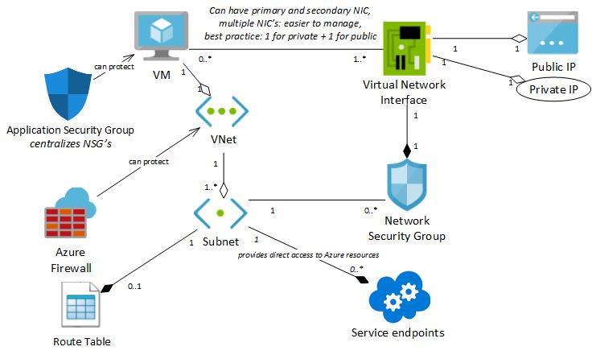

# Deploying and Configuring Infrastructure

## Monitoring

* Monitoring
  * Act of collecting & analyzing data to determine the performance, health, and availability of applications and their dependet resources.
  * 💡 Understanding the operation of applications and alerts lhelps fixing problems before they occur.
* Services in Azure
  * **Application Monitoring**: Application Insights
  * **Deep Infrastructure Monitoring**: Log Analytics, Management Solutions, Network Monitoring, Service Map
  * **Core Monitoring**: Azure Monitor, Advisor, Service Health, Activity Log
  * **Shared Capabilities**: Alerts, Dashboards, Metrics Explorer
* Monitoring costs:
  * Use Pricing Calculator for a specific resource.
  * Review estimated costs when creating a resource
  * See spent costs through Subscription blade
    * You can task resources Cost analysis with e.g. *costCenter: marketing* to filter in cost analysis view.
      * 💡 Recommended to tag & export.
    * You can see your bill in "Invoices", opt-in for PDF invoices & download (more options available in *Azure Account Center*)
    * External services billed separately
  * Get notifications through Azure advisor or using third party services like Cloudyn for anomalies and overspending risks.

### Azure Monitor PaaS

* Pipeline for metric log data coming from any Azure resource provider.
* Fastest telemetry pipeline: Faster than Log Analytics.
* Collected data is saved in Log Analytics to analyze, monitor, visualize metrics and query and analyze logs.
  * *Visualize*: Dashboard, Views, Power BI, Workbooks
  * *Analyze*: Metrics Explorer, Log Analytics
  * *Respond*: Alerts, Autoscale
  * *Integrate*: Event Hubs, Logic Apps, Ingest & Export API's
* You can use alerts to proactively notify you based on rules with Azure Alerts.
* You can access through
  * Azure Insight & Analytics (OMS portal that's now legacy)
  * On Azure portal there's an existing resource called Azure Monitor.
  * Rest API, PowerShell & CLI

#### Data types

* Two levels of logs: resource (*metrics*) and platform (*activity log*, *diagnostic log*).
* All data types can be queried in Portal, PowerShell, Rest API or CLI.
* **Metrics** *(resource level)*
  * All numerical values including
    * All Application Insights data / telemetry
    * System health from VM’s (uses HyperV metrics without any configuration)
  * Can be visualized & queried
  * 30 days free to store & query
  * E.g. requests and errors, average response time, infrastructure metrics
* **Activity Log** *(platform level)*
  * "Outside operations" that are subscription-level events
  * Previously known as “Audit Logs” or “Operational Logs”
  * Determine "what, who and when" for any write operation taken on the resources.
  * Categories:
    * ***Administrative***: Every API call to Azure Resource Manager
      * E.g. create virtual machine or delete network security group
    * ***Service health***: Any service health incidents occured in Azure
      * Come in 5 varieties: Action Required, Assisted Recovery, Incident, Maintenance, Information, or Security.
      * E.g. SQL Azure in East US is experiencing downtime.
    * ***Resourche health***: Status of resources: Available, Unavailable, Degraded or Unknown.
      * E.g. Virtual Machine health status changed to unavailable
    * ***Alert***: All activations of Azure alerts.
      * E.g. CPU % on myVM has been over 80 for the past 5 minutes
    * ***Autoscale***: Events in autoscale engine defined by your settings.
      * E.g. Scale up action failed
    * ***Recommendation***: How to better uilize your resources.
    * ***Security***: Events by Azure Security Center
      * E.g. Suspicious double extension file executed.
    * ***Policy***  all effect action operations performed by Azure Policy.
      * Types include audit and deny
  * 90 days free to store, fore more send to Log Analytics (["connect" button in Activity Logs blade of Log Analytic](https://docs.microsoft.com/en-us/azure/log-analytics/log-analytics-activity)), archive to storage account ([click on Export to Event Hubs in Azure Monitor](https://docs.microsoft.com/en-us/azure/monitoring-and-diagnostics/monitoring-archive-activity-log)) or  stream to other services ([click on Export to Event Hubs in Azure Monitor](https://docs.microsoft.com/en-us/azure/monitoring-and-diagnostics/monitoring-stream-activity-logs-event-hubs)).
    * During export you create a Log Profile you control how/where/what is exporreted for how long.
* **Diagnostic log** *(platform level)*
  * "Inside operations" within the resource
  * Resource-specific with common scheme where resources include their own properties.
  * E.g. IIS logs, web server logging, failed request tracking
  * Can be streamed (to Power BI, Azure Functions etc.), added in blob storage, and sent directly to Log Analytics

#### Azure Alerts

* All alert creation for metrics, logs and activity log across Azure Monitor, Log Analytics, and Application Insights

* Separation of operational and configuration views:
  * **Alert Rules**: Definition of the condition that triggers an alert
  * **Fired Alerts**: An instance of the alert rule firing
* Flow of alerts
  * Set-up alert rule
    * Target resource (e.g. storage account)
      * **Signal**: Types are Metric, Activity log, Application Insights and Log
        * You can have multi-dimensional metrics & monitor multiple metrics with a single rule (currently up to two)
    * **Criteria**
      * Logic test: e.g. six-hour period when capacity is over 10 MB
  * Action group(actions to do)
    * Grouping of different actions to take when the alert is triggered
    * Each action has name & action type e.g. email/sms/push/voice/webhook/automation runbook
      * ❗ Applied rate limiting:
        * SMS: No more than 1 SMS every 5 minutes.
        * Voice: No more than 1 Voice call every 5 minutes.
        * Email: No more than 100 emails in an hour.
        * Other actions are not rate limited.
  * Set alert rule name, description, severity (informational, warning, error, critical)
* Log alerts
  * Defined by Log Query (by Log Analytics), Time period, frequency, threshold.
  * *Number of results alert rules* always creates a single alert, while *Metric measurement alert rule* creates an alert for each object that exceeds the threshold

### Azure Advisor

* Uses telemetry & application configurations to give personalize recommendations and guidance for
  * high availability, security, performance, cost effectiveness *(monitors unused resources and spent)*.
* Common resource, free for all users
* You can download, filter, postpone, dismiss recommendations.
* You can customize by excluding subscription/resource groups, configuring utilization rules (e.g. you can as a subscription owner set CPU to lower threshold)

### Log Analytics  PaaS

* Log Analytics is renamed to “Logs” and “Log Search”
* You collect, correlate, search, and act on log and performance with data with any schema.
* Business value:
  * *Assessing updates*: From logs can guess average patching time
  * *Change tracking*: Abnormal behavior from a specific account by tracking changes throughout the environment
* Can be pulled from:
  * Connected Azure sources e.g. IIS logs, custom text logs with custom fields, error level etc.
  * Office 365, Azure Automations, Back-ups (fully integrated)
* Push from on-prem/cloud Linux & windows (already installed in cloud Windows VM's) with an agent
  * SCOM (System Center Operations Manager) agents communicate with SCOM Server over TLS 1.2 which forward events and performance data to Log Analytics.
    * You can use script via Azure Automation DSC (desired state configuration)
* Query with a pipe-through language
  * Each data source has documentation (description & name) of its properties.
  * Main query tables: *Heartbeat, Perf, Usage, Event, Syslog, Alert*.
  * E.g.: `Event | where (EventLevelName == "Error") | where (TimeGenerated > ago(1days)) | summarize ErrorCount = count() by Computer | top 10 by ErrorCount desc`
  * Can generate charts  `| render timechart` that can be pinned to dashboard.
* You can connect to Activity Logs in Activity Logs section and query with `AzureActivity`
* Free to store logs for 90 days of charge
  * You can export to Excel, PowerBI, or use API to send data or get.
* Applies if in same subscription, or in same Azure Active Directory.
  * Collect data across subscriptions
    * In customer subscription
      * Activity log (*export button*) => Event Hub
    * In Service provider subscription
      * Logic App (*When events are available in Event Hub -> Parse JSON (Body) -> Compose (Select Body in inputs) -> Send Data (Azure Log Analytics Data Collector)*)=> Log Analytics

### Other components

* *Azure Network Monitoring, Azure Service Map, Security Center* is talked about later on.
* Application Insights
  * Handles custom telemetry and built-in from managemend resources
  * Can show **application map**
    * Components (applications, databases etc.), their dependencies, availability (failures), total calls and latency.

## Storage accounts

### Azure Storage PaaS

* Azure storage is PaaS to store files, messages, tables, and other types of information.
  * Subservices: Blob, File, Queue *(more basic than ServiceBus without overhead, 💡 good for >80GB)*, and Table.
* It’s also used by IaaS virtual machines, and other PaaS cloud services.
* Three main roles:
  * Storage for Virtual Machines
    * **Disks** are persistent block storage for Azure IaaS virtual machines.
      * Azure disks handles creation of Storage account for you.
    * **Files** are fully managed file shares in the cloud.
  * Unstructured Data
    * **Blobs** are highly scaleable, REST based cloud object store.
    * **Data Lake Store** is Hadoop Distributed File System (HDFS) as a service.
    * **Tables** are a key/value, auto-scaling NoSQL store.
    * **Cosmos DB** is a globally distributed database service
  * Structured Data
    * **Azure SQL DB** is fully managed database-as-a-service built on SQL
  * A **snapshot** is a read-only version of a storage that's taken at a point in time.
    * Can be read, copied or deleted but not modified.
    * Provide a way to back up a blob as it appears at a moment in time
  * **Azure Storage Explorer**
    * Access multiple accounts and subscriptions.
    * Can manage Blob, Queue, Table, File, Cosmos DB and Data Lake storage.
      * Obtain shared access signature (SAS) keys.
    * Authorization: SAS or Azure account.
* **Azure Storage Accounts**
  * Around 99.9% SLA
  * Kinds
    * Legacy => **General purpose v1**, **Blob storage**
      * Can easily be migrated to v2
    * **General purpose v2**
      * Lowest price, pay per GB
  * Blobs
    * Blob permissions
      * **Private**: Authentication (RBAC or storage key) to access
      * **Blob**: Anonymous access to blobs
      * **Container**: Anonymous access to blobs + containers
    * Blob types
      * **Block blob** is aimed at streaming and storing of objects such as media files and documents. Sequentially accessed.
      * **Page blob** is optimized for random reads and writes. E.g. SQL & VM's uses it.
      * **Append blob** is same as a ***block blob*** except data can only be added to the end of the blob. Blocks elsewhere cannot be deleted nor modified
    * Blob storage access tiers
      * **Hot**: More frequently accessed
      * **Cool**: Less frequently accessed
      * **Archive**: Minimum frequency. Only in v2
  * General-purpose storage account
    * Tables, queues, files, blobs and Azure virtual machine disks under a single account
    * Performance tiers:
      * **Standard**: tables, queues, files, blobs, and Azure virtual machine disks
        * Magnetic drives (HDD) and provide the lowest cost per GB
        * Best for apps with bulk storage or where data is accessed infrequently.
      * **Premium**: Supports only Azure virtual machine disks
        * SSD, low latency performance
        * Best for I/O-intensive applications, like databases
      * ❗ Not possible to convert after deployment
  * Endpoints
    * Default domain name e.g. `http://mystorageaccount.**blob**.core.windows.net`
    * Two ways to configure
      * Direct CNAME mapping
        * Create DNS record *(NS record as TXT or MX)* for Azure URL
          * ❗ For subdomains you use A record.
        * Causes minor downtime as the domain is updated.
      * Intermediary mapping with *asverify*
        * No downtime
        * First create CNAME (in 3rd party) e.g. **azverify**.docs.amk.com
          * Put it in Azure and it gets verified
        * Then create CNAME  (in 3rd party) docs.amk.com
        * You can now delete azverify CNAME record.
  * Creating accounts
    * You can use VNet to restrict the storage to only certain IP address subnets or VNets.
    * ❗ Location must match the location of the resource group
* Data replication
  * Replication strategies
    * **LRS – Locally Redundant Storage**
      * Copies: 1 copy in within a single facility in same region
    * **ZRS – Zone Reduntant Storage**
      * Copies: 3 copies in 3 different availability zones in same region
      * Replicates synchronously
    * **Geo-redundant Storage (GRS)**
      * Copies: In Another data center in a secondary (paired) region
      * Replicates asynchronously.
      * ❗ Not available in all regions
    * **Read access geo redundant storage (RA-GRS)**
      * Copies: As in GRS
      * Read access to the replicate.
        * Blob service is myaccount.blob.core.windows.net, then your secondary endpoint is myaccount-secondary.blob.core.windows.net.
        * The access keys for your storage account are the same for both the primary and secondary endpoints.
  * 💡 You can change your replication strategy later on.
    * From LRS: Free
    * GRS to RA-GRS: incur egress bandwidth charge (one time cost initially)
  * ❗ If you create availability sets for your virtual machines, then Azure uses Zone-redundant Storage (ZRS).
  * ❗ If you select Premium performance only LRS replication will be available.
* Billing considerations
  * Storage costs (per-gigabyte), data access costs, and transaction costs increases as the tier gets cooler.
  * In GRS and RA-GRS, geo-replication data transfer incurs a per-gigabyte charge.
  * Outbound data transfer costs (outside of Azure region) incur billing for bandwidth usage on a per-gigabyte basis.
  * Changing tier from cool to hot costs as  reading cool data, from hot to cool costs as writing data to cool tier.
* Storing and accessing data
  * **AzCopy** is a command-line utility designed for copying data to/from Microsoft Azure Blob, File, and Table storage, using simple commands designed for optimal performance.
  * **Azure Import and Export Service**
    * **Import**: Transfer to Azure Blob storage (***block*** and ***page*** blobs) and Azure Files by shipping disk drives to an Azure data center.
      * **Flow**
        1. The customer prepares the hard drives using Import/Export Client Tool (WAImportExport Tool) that facilitates the process & encrypts the drive with BitLocker.
        2. The customer creates an import job using the Azure Portal / REST API.
        3. The customer ships the hard drives to the data center and enters tracking number in Azure.
        4. Hard drives are shipped back to the customer after the data is imported.
    * **Export** Transfer from Azure storage to hard disk & ship to on-promise sites. You can export ***Block***, ***Page*** and ***Append*** blobs from Azure.
      * Requires you to ship empty disks.
      * Costs extra egress charges when data is exported.
      * **Flow**
        1. Customer creates export job with address & blob container path(s).
        2. The drives are encrypted with BitLocker; the keys are available via the Azure portal.
    * When?
      * Uploading/downloading is slow or costs much
      * E.g. migrating data to the cloud, content distribution to customers, backup, data recovery
    * ❗ Only specific types of disks are supported.
    * ❗ Many regions are not available (US only now).
* Security
  * Network configuration
    * As default it accepts requests from any client, in Settings->Firewalls and virtual networks you can limit networks by choosing **Selected Networks**.
    * You can then add network rule in VNet to allow access to service endpoint of the Storage.
      * When planning for disaster recovery during a regional outage, you should create the VNets in the paired region in advance.
    * You can also set-up IP rules in Storage Account -> Firewalls and Virtual Networks -> Firewall -> Address range for cloud and hybrid scenarios.
      * ❗ Only allowed for public ip addresses
  * Shared access signature
    * Shared access policy includes a key (signatuer) to be used in query string to requests to the storage.
    * The policy can grant access to everything or can limit the access to specific operations (e.g. only read or writes).
* Monitoring storage
  * Capacity metrics
    * Sub-service specific
      * E.g. for blob: *Blob Capacity*, *Blob Container Count*, and *Blob Count*
    * Sent every hour, refreshed daily.
  * Transaction metrics
    * Sent every minute from Azure Storage to Azure Monitor.
    * Available at both account and service level.
    * E.g. *transactions*, *egress*, *ingress*, *availability*
  * Metrics and logs are stored in the same storage account
  * Requires you to enable logging.
  * ❗ Not supported for premium storage accounts as they work differently and for Azure virtual machines

### Azure Content Delivery Network (CDN)

* You can cache content to the user by using servers that are closest to the users.
  * Increases speed and availability
* Can compress.
  * In the Azure portal, you can enable Compression and modify the MIME types list to tune which content formats to compress.
* Flow
  1. User sends request to an *Edge Server*
  2. DNS routes the request to the best performing Point-of-Presence (POP) location (probably geographically closer)
  3. If edge does not have the content, it sends request to origin.
      * Origin can add HTTP headers describing the file's Time-to-Live (TTL).
* **CDN Profiles**
  * You can choose between Microsoft, Akamai or Verizon as implementation.
  * Four choices for **Origin type**: Storage, Cloud Service, Web App, and Custom origin.
  * Supports compression, query string, and geo filtering.
  * Endpoint isn't immediately available for use.
    * Microsoft standard = 10 min, akamai = 1 min, Verizon = 90 min
  * Rules
    * You can set global caching rules
      * e.g. TTL Cache Expiration Duration
    * Or custom caching rules
      * If a pattern match in path & file extensions you can override global caching rules.
  * Optimization options (vendor specific settings)
    * ***General web delivery***: Web content, website, applications, small images
    * ***General media streaming***: Live & video (so  you don’t need to change between live and VOD).
    * ***Video on demand media streaming***: Only for video streaming.
    * ***Large file download***: Large file download: > 10 MB.
    * Uses chunking
      * To disallow failing of whole request.
      * Uses pre-fetch: starts fetching next chunk if the download is on the chunk before.

## Networking

### Good commands when practicing

* Allow ping: `New-NetFirewallRule –DisplayName "Allow ICMPv4-In" –Protocol ICMPv4`
* Install IIS (Webserver): `Install-WindowsFeature -name Web-Server -IncludeManagementTools`

### Virtual Machines IaaS

* **Grouping of VM's**: Availability sets and scale sets.
  * ❗ Defined during creation of VM’s, cannot be applied to existing VM's.
  * **Availability set** IaaS
    * Holds different tiers (instances) so Azure split them onto different places on hardware.
    * Pay only for VM’s
    * Two logical grouping:
      * **Fault domains**: Grouping of domains with common power source + network switch. Separation protects you from hardware/network/power failures.
        * ❗ Max 3
      * **Update domains**: Grouping when maintaining (reboot etc) at a time.
        * ❗ Default = 5, Max: 20
  * **Scale set** IaaS
    * A scale set is an implicit availability set with five fault domains and five update domains.
    * Holds identical instances of images in the scale set so they can be scaled
    * You deploy it via ARM template
* **Deploy Virtual Machines**
  * Methods: Azure Portal, ARM templates, Azure Powershell, Client SDK's, Rest APIs, Azure CLI, Visual studio
  * 💡 In order to qualify for 99.95% SLA, you need to deploy two or more VMs running your workload inside an availability set.
  * Choosing location of VM's
    * Region: Regional pairs allows replication resources, e.g. VM storage
    * Feature availability might change per region
  * Via Portal
    1. Select image or disk.
        * Image
          * Sources
            * **Azure Marketplace**
              * Recent versions of Windows Server & Linux distributions.
              * Some images contain applications, e.g. SQL Server.
              * Linux images are created with Bitnami and certified for Azure
            * **VM Depot**
              * Community managed repository of Linux and FreeBSD virtual machine images.
            * **Custom Images**
              * Create and upload for use in Azure
          * Types
            * **VM Image**
              * Includes an operating system and all disks attached.
            * **OS Image**
              * .vhd file with generalized (via sysprep tool) version of OS.
              * No additional disks are attached.
        * Disk
          * VHD => Virtual Hard Disk
          * You create your own, or use disks from back-ups.
          * Disks used by VMs
            * **OS disk**: Has OS, ❗ Max 2 TB
            * **Temporary disk**: D: drive. Short term storage. Not consistent.
            * **Data disk**: Stores application data. ❗ Max 4 GB, if it's managed 32 GB.
          * Disk choices
            * **Managed**
              * Storage is hidden from you.
              * Microsoft recommended
              * Granular access control
              * Azure Backup service support
              * Better reliability for availability sets
                * Ensures in a set they're isolated from each other.
                * No single point of failure.
              * ❗ Up to 10.000 VM disks in a subscription.
            * **Unmanaged**
              * You connect a storage account to connect a page blob storage
              * 💡 Careful by not having many VM’s in same storage account. You can go over the limits!
    2. Provide required information
        * Such as host name, user name, password for the virtual machine.
        * Authentication types in Linux:
          * **Password**: Using passwords with SSH connections still leaves the VM vulnerable to brute-force attacks or guessing of passwords.
          * **SSH public key**
            * More secure & preferred method
              * SSH is an encrypted connection protocol that allows secure logins over unsecured connections.
            * **Public key**: The public key is placed on your Linux VM, or any other service that you wish to use with public-key cryptography.
              * You can change your public key later on.
              * You need RSA public key, it can be generated using ssh-keygen on Linux and OS X or PuTTYGen on Windows.
            * **Private key**: The private key is only for you.
            * 💡 Azure currently requires at least a 2048-bit key length and the SSH-RSA format for public and private keys.
    3. Provide optional information
        * E.g. domain membership, virtual networks, storage account and availability set.
          * Availability Sets
            * VM's in same set placed at different physical hardware to help prevent downtime by Azure maintenance or regular cycles or failure.
              * if there are multiple VM’s in same set they don’t go down at the same time.
          * Auto-shutdown
            * When the VM is shut down automatically.
            * With “Azure Automation” and have it boot & shutdown on regular basis.
          * Network security group
            * Firewall where inbound/otbound rules lies.
              * During creation you  can set:
                * E.g. HTTP/RDP in a checklist.
                * E.g. SSH for linux
            * Default is all outbound traffic is allowed.
            * RDP for windows is allowed per default for outbound ports.
          * Extensions: E.g. Microsoft Antimalware
          * Monitoring:
            * **Boot**: Records boot sequences, screenshot, error logs etc.
            * **Guest OS diagnostics**: about the OS where the application is running
  * Deploy custom images
    * Several options
      * Use an existing managed disk.
      * Upload a VHD.
      * Copy an existing Azure VM by using snapshots
    * Deploy through uploading VHD
      1. Prepare VHD on-premises
          * Make sure the virtual machine has all the roles and features installed that you need.
          * Generalize
            * Be sure to remove any guest virtualization tools and agents.
            * Ensure the VM is configured to pull its IP address and DNS settings from DHCP. This ensures that the server obtains an IP address within the virtual network when it starts up.
            * **sysprep**
              * Generalization tool for e.g. computer name, security identifier (ID) *(critical in AD domains as logins and SIDs are tied together)*, driver cache, other unique ID's.
              * It generates a VHD.
          * Prepare VM VHD
            * Azure accepts only VHD, use utility tools to convert VHDX, VMDK to VHD.
      2. Create the Storage Container and upload the VHD
* **Redeploy**ing (button in VM) a VM changes its host.
  * Causes downtime
* **VM Sizes**
  * The number of network interfaces they can support is different
  * ❗ Resizing VM causes downtime as the state needs to be stopped.
  * Types:
    * **General Purpose**: Dsv3, Dv3, DSv2, Dv2, DS, D, Av2, A0-7
      * Balanced CPU-to-memory.
      * Ideal for dev / test and small to medium applications and data solutions.
    * **Compute optimized**: Fs, F
      * High CPU-to-memory.
      * Good for medium traffic applications, network appliances, and batch processes.
    * **Memory optimized**: Esv3, Ev3, M, GS, G, DSv2, DS, Dv2, D
      * High memory-to-core.
      * Great for relational databases, medium to large caches, and in-memory analytics.
    * **Storage optimized**: Ls
      * High disk throughput and IO.
      * Ideal for Big Data, SQL, and NoSQL databases.
    * **GPU optimized**: NV, NC
      * Specialized VMs targeted for heavy graphic rendering and video editing.
    * **High performance**: H, A8-11
      * Most powerful CPU
* **Connect to Virtual Machines**
  * Windows
    * In portal, click connect, download RDP file. (enabled by default)
    * SSH in with more configurations
  * Linux
    * Password
      * SSH in *(enabled by default)*
      * Optionally you can set-up desktop environment, download and configure *(open ports in NSG and VM firewall)* RDP client and start it for RDP connections.
    * SSH public key
      * Use PuTTY:
        * Go to session that you saved and type IP address there, e.g. linuxuser@12.84.169.43.
        * In connection SSH=>Auth=>Browse, select the private key.
        * Click “open”
* **Common virtual machine management tasks**
  * Moving virtual machines between resource groups or subscriptions
    * Can do using Powershell or Azure Portal
    * It’ll prompt to you to move all other dependencies as well.
    * ❗ You cannot move Azure Managed Disks at this time.
    * New resource IDs are created as part of the move. After the VM has been moved, you will need to update your tools and scripts to use the new resource IDs.
  * Change VM size (scale up & down)
    * ❗ If size is not supported on the physical cluster it’s hosted, it'll require deallocation of the VM
    * ❗ If the new size for a VM in an availability set is not available on the hardware cluster currently hosting the VM, then all VMs in the availability set will need to be deallocated to resize the VM.
    * ❗ Deallocation may result in Dynamic IP change.
  * Download a VM ARM template
    * Includes all of the dependencies.
    * 💡 Storage account name must be unique so you can use something like: `[uniqueString(subscription().subscriptionId)]`
  * Swap OS Disk
    * You don't have to delete/recreate/de-allocate the VM.
    * If it’s managed disk it must not be in use.
* **Monitoring virtual machines**
  * Available both for Windows & Linux
    * Diagnostic settings (collected information types) are different on windows & linux.
  * Implemented as Agent VM extension.
  * Configure after/during deployment:
    * Boot diagnostics
      * To see why VM gets into a non-bootable state
    * Guest OS diagnostics
      * Collect additional disk, CPU, and memory data.
  * Gathers metrics, diagnostics, and log data
    * Displayed in Azure portal (metrics and boot diagnostics)
    * Stored in Azure storage of a dedicated account (tables and blobs)
  * **Azure Network Watcher** is a blade in Azure that provides tools to monitor, diagnose, view metrics, and enable or disable logs for resources in an Azure virtual network.
    * You can add ***Connection monitors** with source and destination VM to track connection between them.
  * 💡 If you have many different VM machines (e.g. on different tiers), consider larger scale distributed application monitoring systems such as Microsoft EMS.
  * **Network Watcher** enables you to monitor your VM and its associated resources as they relate to the network that they are in.
    * You can install the Network Watcher Agent extension on a Linux VM or a Windows VM.
* **Virtual machine back-ups**
  * **Azure Backup**
    * Managed service for back-ups.
    * Use for production workloads.
    * Creates recovery points that are stored in geo-redundant recovery vaults.
      * Allows you to restore whole VM or specific files later on.
    * Configuration
      1. Create a recovery services vault
          * It stores your back-ups and recovery points.
          * Choose between geo-redundant (default) or locally redundant.
      2. Define the backup in vault.
          * Snapshots (recovery points) are stored in the vault.
            * You can restore VM from any recovery point.
          * Create new back-up
            * Set backup goal with
              * Source: From where (Azure/on-premises/Azure Stack)
              * Object: What e.g. VM, SQL *(depended on source)*
              * 💡 In Site recovery the action is called *protection goal*
            * Configure back-up policy:
              * Frequency (retention range): How often? Ex. once a day, weekly, yearly etc.
              * When exactly? (ex. 11:00 AM Sunday)
          * You can back-up directly with "Back-up Now"
      3. Back-up virtual machine
          * Azure VM Agent must be installed on VM, they’re already installed for VM’s from gallery.
          * Backing up VMs is a within region.
            * ❗ You cannot back up VMs from one region to a Recovery Services vault in another region.
            * ❗ For every Azure region that has VMs to be backed up, at least one Recovery Services vault must exist in that region.
          * For on-premises, you need to install VM agent
    * Restoring VM's
      1. You can choose to restore only files.
          * Restore types: [Three Ways to Restore Azure IaaS VMs](https://newsignature.com/articles/three-ways-restore-azure-iaas-vms/)
            * ***Create a virtual machine***:
              * Basic settings such as VNet,subnet and storage account.
              * ❗ Does not support advanced settings such as e.g. VMs under load balancer, multiple reserved IPs or multiple NICs.
            * ***Restore disks***
              * Copies VHDs into a storage account you specify.
              * You can then create a new VM using these disks or attach existing VM to the disk disk.
            * ***Direct File Recovery***
              * Select recovery point -> Download script to mount VM disks so you can browse them -> Once you restore files, unmount the drives.
      2. Create a new VM
      3. Create a new store disk (copies VHDs).
      4. Replace existing VM (only supported for unencrypted managed VMs from marketplace).
  * **Azure Site Recovery**
    * Protects from a major disaster scenario when a whole region experiences an outage.
      * E.g. due to major natural disaster or widespread service interruption.
    * You can replicate to an Azure region of your choice.
    * You can set up easily on Portal => VM => Disaster recovery with target region.
    * *Explained further in later parts.*
  * **Snapshots**
    * Read only-copies of managed disks.
    * Provide a quick and simple option for backing up VM’s.
    * Snapshot for consistency requires you to stop VM, Azure backup handles it via en extension
    * Can be used to rebuild VM / create new managed disks as they exist independently.
    * Billed based on the used portion of the disk (not whole disk capacity).
* **Azure Disks vs Azure Files vs Azure Blobs**
  * Always hosted in a Storage account.
    * **Azure Files**
      * Good for "lift and shift" operations.
      * Good if data will be shared by multiple applications.
    * **Azure Blobs**
      * Support for streaming & random access cenerios.
      * Access application data from anywhere.
      * ❗ Capacity: Max 2 PiB Account Limit
      * E.g. enterprise data like to perform big data analytics.
    * **Azure Disks**
      * Handles storage account creation for you.
      * Good for lift & shift scenarios for applications that use native file system APIs.
      * ❗ Capacity: Max 5 TiB file shares.
      * You want to store data that's not required to be access from outside the VM to which the disk is attached.

### Virtual Networks IaaS

* Virtual networks are software defined logical isolation that mimics the hardware.
* Virtual networks are defined with address space and at least 1 subnet.
  * 💡 Use an address space that is not already in use either on-premises or in other VNets.
  * If it overlaps => you will have to reconfigure or recreate the VNet.
  * How many to choose? Be carefull!.
    * A best practice:"one octet further in"
    * E.g.: VNet (11.0.0.0/ **8** ) => Subnet (11.1.0.0.0/ **16** )
* ❗ Limitations:
  * By default, you can create up to 50 virtual networks per subscription per region, you can contact support to increase it to 500.
  * A virtual network and its resources are scoped to a single region and single subscription.
    * However, different VNet's from different regions can communicate through ***global peering***.
  * When you move VNet to another resource group, you must move all of its dependencies.
* Name resolution in a VNet:
  * Azure-provided *(default)*
  * Custom DNS server
    * E.g.: Deploy a DNS server and type its address.
* Filter network traffic
  * Security groups
    * Control inbound / outbound rules
    * Network Security Groups
    * Application security groups (on application level)
  * **Network virtual appliance (NVA)**
  * A network virtual appliance is a VM that performs a network function, such as a firewall, WAN optimization, or other network function.
  * They're often used in DMZ (perimeter network)
    * **DMZ**: Security zone protects internal network from an untrusted network.
* Route network traffic
  * **Route tables**
    * Associated to one or more subnets.
    * Defines routes = where next hop will go
      * If matching route can't be found, the packet is sdropped
    * Azure manages following situations with **system routes**:
      * VM <=> VM in same subnet
      * VM <=> VM in different subnet in same VNet
      * Internet <=> VM
      * VNet-to-VNet VPN communication between VMs
      * Site-to-Site and ExpressRoute communication through the VPN gateway.
    * User-defined routes (UDRs):
      * To a virtual appliance (router, firewall, WAN optimization)
      * Appliance between subnets tier (front-end back-end) or (subnet internet)
      * 💡 Deploy virtual appliance to different subnet. If it's in same subnet where it's routed it can result in routing loops where traffic never leaves the subnet
    * Routing algorithms:
      * If address matches multiple routes then Azure makes decision based on:
        1. ***Prefix match algorithm***: Less range is selected.
        2. ***Route priorities*** (if prefixes are the same)
            * User-defined route > BGP route > System route
    * 0.0.0/0 address prefix => Routed to internet by default (can be overridden).
  * **Border gateway protocol (BGP)** routes:
  * Standard protocol commonly used.
    * Routes are automatically added to route table.
    * Obligatory with Express Route, optional with VPN Gateway
    * Support multiple tunnels.
    * Provides transit routing between on-prem <=> Azure VNet via VPN gateway.
      * Transit route => A->B & B->C => A->C
    * You can propagate your on-premises BGP routes to your virtual networks through Azure VPN Gateway or ExpressRoute connection.

#### Virtual Network Interface

* Groups & manages public + private IP.
  * The address for each NIC are within the same subnet.
* Associations:
  * A VM must have at least one network interface attached to it.
  * It can have ***network security group*** associated with it.
  * It has a ***VNet*** and ***subnet*** associated with it.
* 💡 Adding an virtual network interface does not cause any downtime.
* **Multiple NIC's**
  * Best practice recommended by Microsoft.
  * Reason
    * Requirement for many network virtual appliances.
    * Having different front-end and back-end NIC(s) makes administration/management easier
  * ***Primary NIC*** is first NIC attached, ***secondary NIC(s)*** are the others.
  * By default outbound traffic is sent by IP from primary NIC and Load Balancer pool uses primary NIC IP.
  * ❗ Limitations
    * VM size limits how many NIC's can be attached.
    * Only one NIC can have public IP.
    * The order *(names)* of the NICs inside the VM will be random or can be changed after Azure updates etc, but IP and MAC addresses stay the same.
    * In an availability set for each VM must use either multiple NICS or single.
      * You cannot mix.
    * Single NIC <=> Multiple NIC(s) configuration requires VM to be re-deployed.
* **IP addressing**
  * **Prefix**: e.g. 10.1.0.0/24
  * Dynamic <=> static switch requires NIC to be restarted.
  * Effects subnet configuration.
    * Azure best practice is to manage subnets separately.
    * Subnet for static IP's and subnet for dynamic IP's.
      * E.g. in multi-tier application web servers and load balancers will have public IP's but internal web application data layers won't have public IPs.
      * E.g. in big infrastructure where they have one or two jump boxes that have public IPs for the purpose of doing administration.
        * A box you can RDP to and then from there access other systems inside the implementation versus giving everything a public IP.
  * Default gateway is completely managed by Azure. You cannot modify.
  * **Public IP**
  * Used for external internet communication.
  * Azure ARM object with a globally unique name.
  * Used in: *VM's, load balancer, VPN gateway, Application Gateway*.
  * Can be static or dynamic.
    * Static IP do not change and is good for:
      * DNS name resolution.
      * IP address-based security
      * SSL certificates linked to an IP
      * Firewall rules
      * Role-based VMs such as domain controllers and DNS servers
  * SKU's
    * Basic
      * Can be assigned to any Azure resource
      * Assigned to a zone and not zone redundant.
    * Standard
      * Always static.
      * Can only be assigned to: NIC's, public standard load balancers
      * Zone redundant by default.
  * You can set custom DNS server.
    * DNS server of VM is inherited from VNet, not IP address.
  * **Private IP**
    * Used within VNet and subnets.
    * Can be used on-premises with VPN gateway or ExpressRoute.
    * Can be static or dynamic
    * Resources: in VM's, Load balancers and Application gateway.
  * **IP Forwarding**
    * Modifies IP address to reach right target.
    * Allows transient flows. E.g. NIC3 lets a NIC1 trying to communicate with NIC2 that it has no route to but only to NIC3 by IP forwarding during routing.

#### Azure Gateways

* They're used to exit & come back in to private network.
* Requires gateway subnet to exist to the VNet
* ❗ Do not associate NSG on gateway subnet.
* **Azure Application Gateway**
  * Layer 7 load balancers / reverse proxies
  * ❗ Works with different availability zones but only across same region.
  * Supports:
    * ***SSL termination***: Traffic flows unencrypted to the back-end servers.
    * ***Connection draining***: Remove back-ends using REST or they're removed automatically if their health status is not ok.
    * ***Custom error pages, Web application firewall, URL-based routing, multiple-site hosting, redirection, session affinity, websocket, rewrite HTTP headers***
* **Azure Virtual Network Gateway**
  * It's assigned to a VNet in a gateway subnet.
    * A VNet can have 1 gateway subnet and only 1 gateway in it.
  * Used for Azure <=> Azure or Azure <=> On-prem
  * Traffic goes through public internet
    * Requires public IP.
  * Two types: VPN, ExpressRoute
    * **Azure VPN Gateway**
      * Encrypts & routes the traffic via IPSec/IKE *(better than SSL)*
      * Between two or more vritual machines in _gateway subnets_.
  * Settings:
    * Type:
      * **PolicyBased**
        * Also called **static routing**
        * IPsec policies decides where/whether to send.
      * **Route based**
        * Route table decides where/whether to send.
        * Also called **dynamic routing**
        * Required for **Multi-Site VPN**, **VNet to VNet**, and **Point-to-Site**.
    * SKU: Limits the number of tunnels you can have and the aggregate throughput benchmark.
      * Basic has no public IP.

#### Virtual Network Connectivity

* Communicate between Azure resources:
  * ***Through virtual network service endpoints***
    * Endpoints allow you to secure your critical Azure service resources to only your virtual networks.
    * Available for: _Azure Storage, Azure SQL, PostgreSQL, MySQL, Cosmos DB, Key Vault, Service Bus, Event Hubs_
  * ***Through a virtual network***
    * Some resources can be deployed directly to a virtual network.
      * E.g. Redis, Azure Kubernetes Service, App Service Environment...
* Communicate with on-premises resources or intersite connectivity:
  * **VPN Gateway Connections**
    * Gateway to gateway connections.
    * Requires shared key that both parts know.
    * Azure VPN gateways provide secure tunnel using IPSec/IKE.
    * You can see & verify established connections in VNet->Gateway->Connections blade as "Status: Connected"
    * **VNet <=> VNet**
      * Works across regions, subscriptions, deployment models, cloud/on-prem.
      * Use one VNet as gateway and peer other ones on Azure. Gateways on every VNet is costly & slow!
      * On Azure the connection does not go over the internet.
      * Deploy Gateway on each VNet.
        * Set-up connection in VNet1 gateway to VNet2
        * Set-up connection in VNet2 gateway to VNet1
      * If one VNet is on-prem it's called **Site-to-site (S2S)**
        * On-premises VPN device <=> Azure VPN Gateway
        * The local gateway is configured manually
        * Problem: All users download VPN client to connect Azure.
          * Easier: Have a hardware device as jumpbox and use it as gateway through secure ip tunneling.
          * Even easier: ExpressRoute.
    * **VNet <=> Device (with VPN Gateway)**
      * Or **Point-to-site virtual private network** (VPN)
      * Configure =>
        * IP address space for clients.
        * Configure virtual gateway
        * Create root and client certificates & upload to azure
        * Install VPN client configuration created by Azure
        * Connect to VPN
    * **Azure ExpressRoute**
      * Private connection that does not go over the internet.
      * BDP is the only routing way.
      * Reliable => Circuits consist of two connection to Microsoft Enterprise Edge.
      * Facilitated by a connectivity provider (e.g. Telia, Tele2)
  * Connect virtual networks in Azure
    * **Virtual Network peering**
      * The virtual networks you connect are across subscriptions and regions.
      * All traffic is routed over Azure internal networks, handled by Azure infrastructure.
      * Faster & easer to setup than VPN
      * No public IP required
      * No downtime when creating/configuring peering.
      * Regional network peering => In same VNet
      * Global network peering => Cross region VNets (in preview)
      * Requirements:
        * Public clouds (not Azure national clouds)
        * Resources in one VNet cannot communicate with load balancer in the peered VNet. Load balancer and resources that communicate with it must be in same VNet.
      * ❗ Limitations:
        * Not transive.
          * E.g.: VNet1<=>VNet2 and VNet2<=>VNet3 does not mean VNet1<=>VNet3
        * No overlapping address spaces
        * Any address space changing => Destroy peering re-deploy
      * Settings:
        * _Allow forwarded traffic_: Allows traffic not originated from within peer VNet to VNet.
        * _Allow gateway transit_: Peer VNet uses your network gateway.
          * Allows you to have single gateway, instead of gateway per VNet (called hub-spoke topology)
          * Examples:
            * Site-to-site VPN <=> On-prem network
            * VNet-to-VNet <=> Another VNet
            * Point-to-site VPN <=> Connect client
        * _Use remote gateways_: Uses peer's virtual gateway.

## Azure Active Directory PaaS

### Active Directory Domain Services (ADDS)

* Other name: Windows Server Active Directory
* On prem solution.
* A directory service that includes
  * Active Directory Federation Services (AD FS)
    * Authenticates via AD DS
    * Federated identity  =
      * When the user logs into a service, instead of providing credentials to the service provider, the service provider trusts the identity provider to validate the credentials. So the user never provides credentials directly to anybody but the identity provider.
    * _Active Directory Certificate Services (AD CS), Active Directory Lightweight Directory Services (AD LDS), and Active Directory Rights Management Services (AD RMS)_
  * Different architecture than Azure Active Directory.
    * Logical divisions:
      * **Objects**: users, printers etc.
      * **Domain**
        * Groups objects
        * Each domain holds a database containing object identity information.
        * Domains are identified by their DNS name structure, the namespace.
      * **Tree**
        * A collection of one or more domains and domain trees in a contiguous namespace
        * Linked in a transitive trust hierarchy
      * **Forest**
        * At top of the structure
        * A collection of trees that share a common global catalog, directory schema, logical structure, and directory configuration.
        * The forest represents the security boundary within which users, computers, groups, and other objects are accessible.
  * **Domain controller (DC)** is a server computer that responds to security authentication requests (logging in, checking permissions, etc.) within a domain.
    * Multiple instances can be deployed.
  * You can deploy AD DS to Azure as VM but:
    * You manage the deployment, configuration, virtual machines, patching, and other backend tasks.

### Azure Active Directory PaaS

* Different than Active Directory, it's flat: no domains, objects, forests etc.
* ***Identity management solution***: multi-factor authentication, device registration, self-service password management, self-service group management, privileged account management, RBAC, application usage monitoring, auditing & security monitoring & alerting.
* Tenant in Azure = AAD instance
  * Each subscription trusts an AAD tenant, multiple subscriptions can trust a single tenant.
    * Add custom domain
      * All AD accounts come with domainname.onmicrosoft.com
      * Go to AD -> Custom Domain Names -> Add domain -> Verify domain name with a TXT record
  * Used by (can be shared with) Office 365, Microsoft Dynamics CRM and Microsoft Intune.
* **Azure AD Identity Protection**
  * Features:
    * Get view of flagged users & risk events detected by ML algorithms.
    * Set risk-based Conditional Access policies to automatically protect your users.
    * Improve security posture by acting on vulnerabilities.
  * Activate it from Azure Marketplace.
* **Azure AD directory**:
  * List of users + groups
  * Each Azure tenant has a dedicated and trusted Azure AD directory. The Azure AD directory includes the tenant's users, groups, and apps
  * HTTP/HTTPS based:
    * Queried via REST using Microsoft Graph API
    * Uses protocols like SAML, WS, OpenID and OAuth 2 for authorization
* **Access reviews**
  * It works by creating an access review with defining who'll review it, what'll be reviewed (resource roles, groups, apps, directories, user(s)), and when it'll be reviewed (frequency or deadline) then assign it to a reviewer. The reviewer will then get a deadline and notification for the review.
  * Good when:
    * Too many users in privileged roles
    * When a group is used for a new purpose
    * Business critical data access
    * To maintain a policy's exception list
    * Ask group owners to confirm they still need guests in their groups
* Other benefits
  * Single sign-on to any cloud (Office365, salesforce, dropbox, custom ..) or on-premises web app.
  * ***Self-service tools*** *(means tasks not requires an admin)*:
    * ***Self-service password management***: Users can reset heir passwords
      * Authentication methods:
        * Email, mobile phone, office phone, security questions.
        * At least one must be selected, better with multiple
      * ***Self-service group management***: Users can create groups
      * Enabled in Portal -> AD -> Self-Service Password Reset
  * Can be integrated with Windows Server Active Directory
  * Used in Office 365, Azure and Dynamics CRM online.
  * ***Conditional access policies***
    * When this happens, Then do this
      * *(Occurences)* e.g. unknown device, e-mail user
      * *(Actions)* ***Risk-based policies***: E.g. risk is high that user is a bad actor, enable MFA (multi factor authentication)
    * Configure through Portal: AD -> Conditional Access -> New Policy
  * ***Device Management***:
    * **Register** a device (can be combined with mobile device management)
      * It's cloud only solution for personal devices
    * **Join** a device = extend registered device, add corporate network so people can log-in from there.
      * For devices that are owned by your organization, can be hybrid
      * No additional authentication prompts
    * **Enterprise State Roaming (ESR)**
      * Sync Windows 10 devices with Azure AD.
      * Provides users with a unified experience across their Windows devices and reduces the time needed for configuring a new device
* SKU's:
  * **Basic**: cloud centric application access
    * self-service identity management, group-based access management, self-service password, basic reports, object limitations, smart lockout (not configurable risk level).
  * **Premium P1**
    * Better hybrid support, seamless sign on, company branding
  * **Premium P2**
    * Advanced reports, write-back
    * ***Identity protection***: Uses ML in background scores the risk of authentication.
    * ***Privileged identity management***
      * Allows users to elevate their privilege to a higher level to perform a particular task.
        * Users elevate their account to admin to perform a task and then de-elevate the account.
      * Require Multi-Factor Authentication
      * Access reviews
      * Schedule activations for a specific date
      * Receive notifications when users are assigned
      * Configure and resolve alerts for privileged roles

### Roles

* Each role is a set of properties defined in a JSON file per API.
* Includes name, id, desc + allowable permissions (Actions), denied permissions (NotActions), and scope (read access etc.) for the role.
* Built-in roles:
  * **Owner** has full access to all resources including the right to delegate access to others.
  * **Contributor** can create and manage all types of Azure resources but can't grant access to others.
  * **Reader** can view existing Azure resources.
* **Azure Identity and Access Management Solutions (IAM)**
  * **oo** Roles tab you can see and manage what the roles are and how many users/groups are assigned to the role.
  * **oo** It can be on subscription/resource or Azure level.
    * Assignments are inherited down resource hierarchy: Azure > Resource Group > App
* **Azure role-based access control (RBAC)**
  * **Role assignment**: Grant access by assigning a *Security Principal*, a *Role* at a *Scope*
    * **Security principal**: User, group or service principal (resources e.g. VM, web app).
      * Service principals are assigned to a **Managed Identity**.
        * Roles and permissions can be delegated to service principals by modifying value of their Managed Identities.
    * **Role** : Built-in or custom role
      * Roles are specific to level, app type *(VM, storage)*
    * **Scope** : Subscription, resource group or resource

### Azure Active Directory vs ADDS

| **Aspect** | **Azure AD** | **Azure AD Domain Services** |
| --- | --- | --- |
| Device controlled by | Azure AD | Azure AD Domain Services managed domain |
| Representation in the directory | Device objects in the Azure AD directory. | Computer objects in the AAD-DS managed domain. |
| Authentication | OAuth/OpenID Connect based protocols | Kerberos, NTLM protocols |
| Management | Mobile Device Management (MDM) software like Intune | Group Policy |
| Networking | Works over the internet | Requires machines to be on the same virtual network as the managed domain. |
| Extending | Relies on federation to extend scope | Uses trusts between domains for delegated management |
| Great for ... | End-user mobile or desktop devices | Server virtual machines deployed in Azure |

### Hybrid Identities

* **Hybrid identity**: Azure identities with on-premises AD connection
* **Azure AD Connect**
  * Installed on a domain controller, handles sync to Azure AD.
  * **Configuration**: Register Azure AD account and AD DS account, and do some checkboxes => done.
    * **Device writeback** Devices must be located in the same forest as the users.
  * Can set up **Seamless SSO**
    * Works with both *Password Hash Synchronization* and *Pass-through authentication*
    * Automatically sign in user with their Azure ID if they're on domain joined device.
    * Works via JS, trusts Kerberos ticket.
    * Flow
      1. **Prerequisites**: Set up your Azure AD Connect server, Enable modern authentication
      2. **Enable the feature**: Enable Seamless SSO through Azure AD Connect.
      3. Roll out the feature:
          * Add `https://autologon.microsoftazuread-sso.com` by using Group Policy.
          * Because browsers will not send Kerberos tickets to a cloud endpoint, like the Azure AD URL, unless you explicitly add the URL to the browser's Intranet zone.
      4. Test the feature
      5. Roll over keys
          * Periodically roll over these Kerberos decryption keys - at least once every 30 days.
          * Keys can be used to create tickets and are vulnerable.
  * **Azure AD Health**
    * Monitor & gain insights into
      * AD FS servers, AD connect, AD domain controllers.
      * Synchronization between AD DS and Azure.
      * Alert can be set up.
* **Azure authentication methods** *(hard to change later on)*:
  * **Cloud only**: No infrastructure on premises.
  * **AD Connect cloud accounts**
    * Just username is synced from on-prem AD DS.
    * Requires users manage two passwords.
  * **Password hash synchronization (PHS)**
    * Synchronizes hashes of passwords from an on-prem AD to a Azure AD.
    * Azure-based authentication security:
      * ***Smart lockout***: prevents brute force attacks, and prevents genuine users from being locket out.
      * ***Leak credential report***:Microsoft scans web and dark web for leaked accounts & requires password reset if account is leaked.
    * Active password write-back or password changes on Azure will not be updated on-prem
  * **Pass-through authentication (PTA)**
    * Authentication is on premises.
    * You deploy two or more (for availability) authentication agents on-premises.
      * They make persistent connection to Azure (ExpressRoute has circuits for this)
      * Outbounds to HTTPS 443 (no need for perimeter network)
        * Pulls authentication requests
        * Pulls rules
          * When to change password?
          * What hours I can log in?
    * Azure AD encrypts with public key, places it on queue, auth agent listens & decrypts with private key, authenticates and returns back the success/fail message.
    * Supports *smart lock-out* but no *leak credential report*.
    * Requires installation agent on the same server as Azure AD connect.
      * Install on more servers (can be domain controllers) for high availability.
  * **Federation (AD FS)**
    * Federation is a collection of domains that have established trust.
    * Recommended if something Azure does not support is used, can be smart card, biometrics, third party authentication etc.
    * Create Azure VM domain on-prem which is a replica of domain controller in Azure.
      * You can then join machines to this managed domain using traditional domain-join mechanisms.
      * Complex set-up
      * When?
        * *Lift & shift workloads*: You move all of your domain controllers to Azure.
    * 2 or more (for availability) AD FS servers to accept authentication requests.
    * An AD DS instance is registered in Azure.
* 💡 Microsoft recommendation:
  * Cloud only accounts > AD Connect cloud accounts > AD Connect + PHS (and SSO) > AAD Connect PTA (+ SSO) > AD Connect + AD FS
