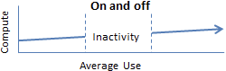
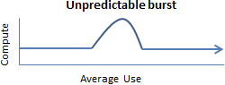
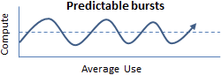

# Developing for autoscaling

- Applications workloads are unpredictable
  - Overestimate => Pay for unnecessary compute resources
  - Underestimate => Poor user experience
  - Ideally => Use extra instance only when it's needed and shut down when it's not.

## Workload Patterns

- 📝 Four common computing patterns you'll see for web applications in cloud
  - **On and Off**
    - |||||....|||||......
    - 
    - E.g.: batch processing.
  - **Growing fast**
    - |.||.|||.||||.|||||.||||||
    - 
    - Often growing start-ups.
  - **Unpredictable bursting**
    - |..|..|||||||||..|.|
    - 
  - **Predictable bursting**
    - |.|.||||.|.|.||||.|.|
    - 
    - E.g. during black friday for a e-commerce site.
- Distribute applications across multiple instances to provide redundancy + performance.
  - A load balancer is needed to distribute.

## Auto scale

- Primary advantage of the cloud is **elastic scaling**.
  - Ability to use as much capacity as you need, scale out if load increases, scale in  when the extra capacity is not needed.
- Supported in many Azure Services
  - IaaS: Azure Virtual Machine Scale Sets (identical VM's in same set)
  - PaaS: Azure App Service
  - Or event database services such as Cosmos Db
- Auto-scale metrics
  - Supported in all pricing plans of App Service.
  - Autoscale can be triggered based on metrics or at scheduled date and time.
  - Metrics are aggregated over all instances of the plan
  - E.g. `CpuPercentage`, `MemoryPercentage`, `BytesRecieved`, `BytesSent`, `HttpQueueLength`, `DiskQueueLength` (read+writes queued on storage)
- ❗ Basic plan does not include AutoScaling
