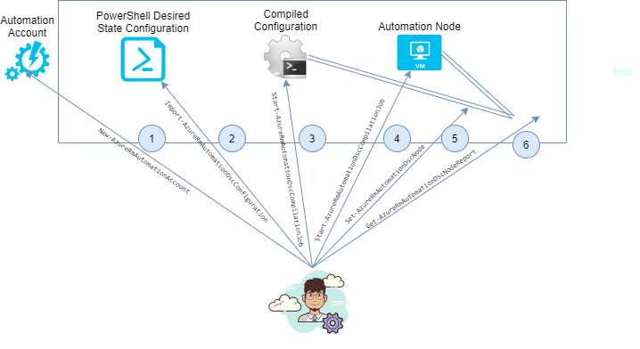

# Configuration as Code

## PowerShell Desired State Configuration

- Management platform in PowerShell
- Manage IT infrastructure with configuration as code
  - E.g. if VM changes, ensure IIS (server) will be in its configured state
    - Configuration would look like:

      ```powershell
        configuration IISInstall {
            node "localhost" { # Ensure applied to this node
                WindowsFeature IIS {
                    Ensure = "Present"
                    Name = "Web-Server"
                }
            }
        }
      ```

    - In *Extensions* section of an VM, you need to install *PowerShell Desired State Configuration*
      - Zip the configuration upload it as Configuration Modules/Scripts
      - Type name of the configuration e.g. `config.ps1\IISInstall`
- PowerShell DSC consists of **Configurations**.
  - These are declarative PowerShell scripts that are used to define the configuration of the underlying resources they are attached to.
- **Resources** contain the code that keep the target of a configuration in a specified state.

## Azure Automation

- Cloud-based automation and configuration service.
- Allows you to do:
  - **Configuration Management**:
    - Collect inventory for your resources
    - Track changes
    - 📝 [Implement Desired State Configuration](#implement-desired-state-configuration)
  - **Update Management**
    - Manage OS updates in Azure, on-prem or in other cloud providers
    - Access compliance and for scheduled update installations
- **Azure Automation account**
  - Similar to Azure Storage accounts in that they serve as a container to store automation artifacts
- **Runbook**
  - Set of tasks that perform some automated process in Azure Automation
  - Webhooks allows to start a particular runbook in Azure Automation through a single HTTPS request.
- **Automation Shared resources**
  - Resources that allow to be used in, or associated with a runbook e.g Schedule
- **Process Automation**
  - Orchestrate processes using PowerShell and Python.
- Source control integration allows you to
  - push code from Azure Automation to source control
  - pull your runbooks from source control to Azure Automation.

### Implement Desired State Configuration

- [Official walkthrough](https://docs.microsoft.com/en-us/azure/automation/tutorial-configure-servers-desired-state)
- 
- 📝 Steps
  1. Create an automation account (`New-AzureRmAutomationAccount`)
     - Enable option to create an **Azure Run As** account
       - It's an AD service principal Azure will create & assign Contributor RBAC role to it.
       - Allows you to authenticate with Azure when managing resources
         - Automate the use of global runbooks configured in Azure alerts
       - [Read more](https://docs.microsoft.com/en-us/azure/automation/manage-runas-account)
  2. Upload the Desired State configuration (`Import-AzureRmAutomationDscConfiguration`)
     - Create a DSC configuration script & upload it
  3. Compile the Configuration (`Start-AzureRmAutomationDscCompilationJob`)
     - A DSC configuration must be compiled into a node configuration before it can be assigned to a node.
     - 🤗 Behind the scenes it compiles the PowerShell script to a `.moc` (Managed Object Format) file that has C++-like syntax.
  4. Register a VM as node to the automation account (`Register-AzureRmAutomationDscNode`)
     - Add VM in DSC -> Nodes.
     - Configuration settings:
       - The Local Configuration Manager (LCM) is the engine of Desired State Configuration (DSC)
       - Configuring LCM:
         - Refresh frequency: E.g. every 30 min automation account will check configuration on VM
         - Configuration mode:
           - **ApplyAndMonitor**
             - Applies any new configurations.
             - If target node drifts from the desired state later on, DSC reports it.
           - **ApplyOnly**
             - Applies initial configurations.
             - DSC does not check for drift from a previously configured state
           - **ApplyAndAutoCorrect**
             - If target node drifts from the desired state later on, DSC reports & re-applies current configuration.
  5. Assign a node configuration to a managed node (`Set-AzureRmAutomationDscNode -NodeId $node.Id`)
  6. (Optionally) Check the compliance status of a managed node (`Get-AzureRmAutomationDscNodeReport`)
     - Node status can be "Compliant", "Failed", or "Not Compliant"

## Custom Script Extension

- Allows for the download & execution of scripts on Azure VMs
- Deploy any post deployment configuration & install any software
- E.g. script to install IIS on a Windows machine:
  - In portal go to VM 0 => Extensions => Custom Script Extension
  - Add using:

    ```ps1
        Import-Module ServerManager
        Install-WindowsFeature Web-Server -IncludeAllSubFeature
    ```

- Example for deploying extension using [ARM template](https://docs.microsoft.com/en-us/azure/virtual-machines/windows/template-description):

  ```jsonc
    {
      "name": "MyCustomScriptExtension",
      "type": "extensions",
      // ...
      "properties": {
        "publisher": "Microsoft.Compute",
        "type": "CustomScriptExtension",
        // ...
        "settings": {
          "fileUris": [
            "[concat('https://', variables('storageName'),
              '.blob.core.windows.net/customscripts/start.ps1')]"
          ],
          "commandToExecute": "powershell.exe -ExecutionPolicy Unrestricted -File start.ps1"
        }
    }
  ```
