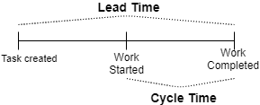
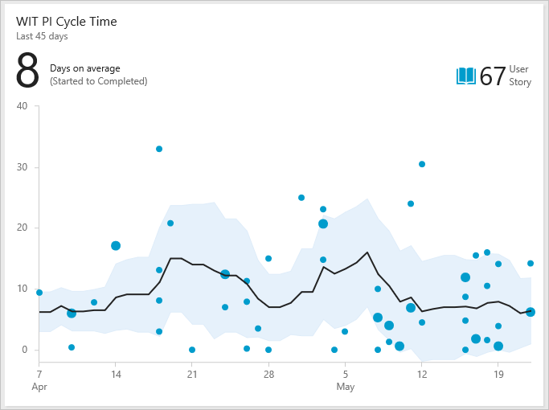
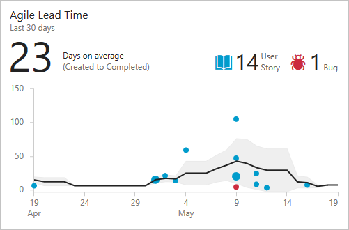
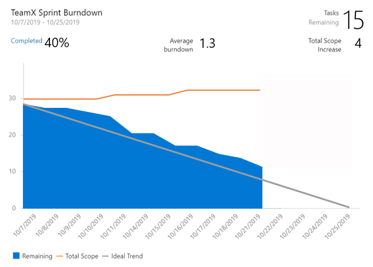
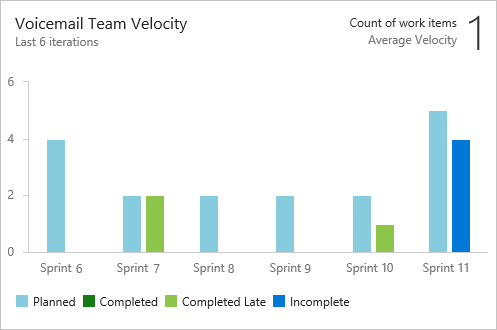
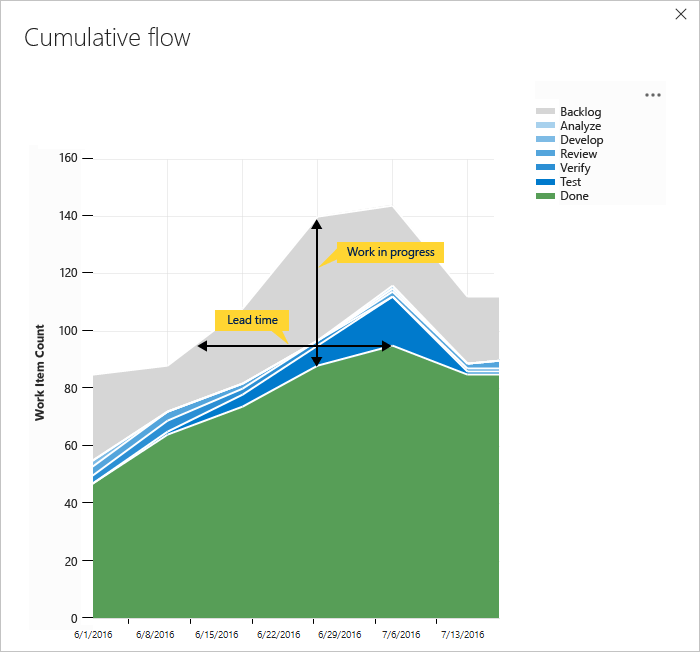

# Agile work management

## Benefits

- Allows for faster delivery of product features to your customer
  - Leads to increased customer satisfaction.
- Reduced risks since you have small feature releases carried out frequently
- Predictable costs and schedule
- Easily allows for change

## Traditional Waterfall Model

- Stages
  1. **Requirements**: Business analysts gets all requirements from customers.
  2. **Design stage**: Peers & architects design application
  3. **Code**: Dev teams work with application
  4. System testing
  5. User Acceptance Testing
  6. Software release
- Problems
  - Release date can be far into the future.
    - Can be redundant even before release as business can change
  - Bugs & issues detected during the testing phase, it can delay the release as you repeat stages.
  - Software may not comply with the requirements
    - E.g. during coding stage design requirements can change which will not be reflected.
    - As result, user may not get what he/she wants

## Scrum

1. Have a vision / goal
2. User stories: describes what customer / end user wants
3. Product backlog
   - Start taking tasks from user stories
4. Pick tasks from product backlog to sprint backlog
5. Work with them during a sprint
   - Sprint = 1-2 weeks
   - Sprint results in working functionality
6. Retrospective & review meetings

## Reporting (Project metrics)

- Important to avoid frustrations such as late deliveries
- Understand how your work items are progressing in terms of development, testing, release
  - Are work items being tracked to completion?
  - Are feature requests being tracked?
  - Time remaining for key work items
  - Time spend on work items.
- Normally use cumulative flow diagrams to monitor the flow of work.
- 📝 Primary metrics are:
  - 
  - **Cycle time**
    - How long it takes to complete one production cycle
    - Calculated by `work completion time - start of doing work`
    - 
  - **Lead time**
    - Measures `work completion time - work requested time`
    - 
  - **Burndown**: Shows remaining work within a specific time period.
    - Burnup is exactly like burndown, except that it plots work completed, rather than work remaining.
    - 
  - **Velocity**
    - Indication of how much work a team can complete during a sprint based.
    - 
  - **Cumulative Flow Diagram**
    - See the count of work items over time of a Kanban board.
    - 
