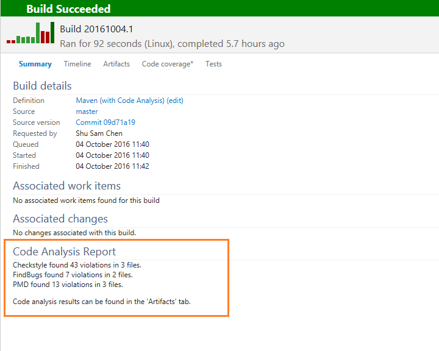

# Continuous Feedback

- You can integrate Azure DevOps with Slack & Microsoft teams
- You can then integrate Azure Boards & Pipelines to e.g. :
  - Create issues, monitor pipeline results, approve release requests
- Continuous Experimentation mindset
  - Design practices to measure end-user satisfaction
  - Design processes to capture and analyze user feedback
  - Design process to automate application analytics
- Analytics
  - Developers need to be able to look for patterns in log messages to identify if there is a problem in the code.
  - Operations need to do root cause analysis across multiple log files to identify the source of the problem in complex application and systems.

## Test & Feedback extension

- Helps teams perform exploratory testing and provide feedback
- Users can install the "Test & Feedback" extension in their browserAzure DevOps
- You can then:
  - Capture notes, screenshots with annotations, user actions, page load data & system information
  - Create sessions in the browser itself
  - Log sessions against work items in Azure Boards
    - E.g. create test cases & bugs
- [Access levels](https://docs.microsoft.com/en-us/azure/devops/test/connected-mode-exploratory-testing):
  - **Basic**
    - Can use the extension to perform exploratory testing
    - [Can request feedback](https://docs.microsoft.com/en-us/azure/devops/test/request-stakeholder-feedback?view=azure-devops#request)
  - **Stakeholder**
    - Can use the extension to respond to feedback requests or to provide feedback voluntarily.
  - Both can use extension to respond feedback requests sent by the team by choosing the ***Provide feedback*** link in the email.

## Static Code Analysis

- Reports feedback about the code
- Can be embedded in IDE e.g. [Microsoft.CodeAnalysis](https://www.nuget.org/packages/Microsoft.CodeAnalysis)
- PMD, CheckStyle and FindBugs support for Maven and Gradle is currently available in Azure DevOps Services ([official docs](https://docs.microsoft.com/en-us/azure/devops/java/standalone-tools))
  - [PMD](https://pmd.github.io/)
    - PMD is a source code analyzer.
    - It finds common programming flaws like unused variables, empty catch blocks, unnecessary object creation, and so forth
  - [CheckStyle](https://checkstyle.sourceforge.io/)
    - Help programmers write Java code that adheres to a coding standard
  - [FindBugs](http://findbugs.sourceforge.net/)
    - Program which uses static analysis to look for bugs in Java code
- Example Apache Maven task ([offical docs](https://docs.microsoft.com/en-us/azure/devops/pipelines/tasks/build/maven?view=azure-devops)):

  ```yaml
    - task: Maven@3
      inputs:
        #mavenPomFile: 'pom.xml'
        #publishJUnitResults: true
        #testResultsFiles: '**/surefire-reports/TEST-*.xml' # Required when publishJUnitResults == True
        #codeCoverageToolOption: 'None' # Optional. Options: none, cobertura, jaCoCo. Enabling code coverage inserts the `clean` goal into the Maven goals list when Maven runs.
        #codeCoverageClassFilter: # Optional. Comma-separated list of filters to include or exclude classes from collecting code coverage. For example: +:com.*,+:org.*,-:my.app*.*
        #codeCoverageClassFilesDirectories: # Optional
        #codeCoverageSourceDirectories: # Optional
        #codeCoverageFailIfEmpty: false # Optional
        #...
        #sonarQubeRunAnalysis: false
        #sqMavenPluginVersionChoice: 'latest' # Required when sonarQubeRunAnalysis == True# Options: latest, pom
        #checkStyleRunAnalysis: false # Optional
        #pmdRunAnalysis: false # Optional
        #findBugsRunAnalysis: false # Optional
  ```

  - 
  - See also [test tools](./4.1.%20Continuous%20Testing%20-%20Choosing%20Test%20and%20Work%20Management%20Tools.md#test-tools)
