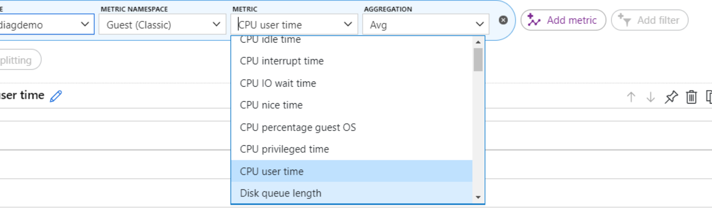
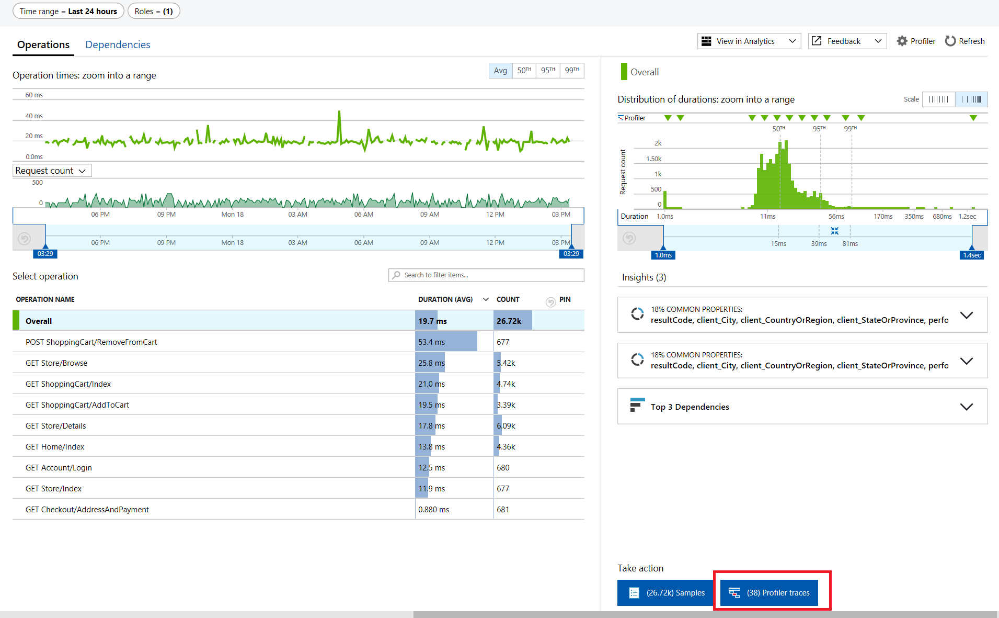

# Azure Monitor

- Allows continuous monitoring.
- Collect & analyze & act on telemetry data from cloud & on-prem environment
- It collects Metrics (e.g. CPU usage) and Logs
- Tools:
  - Insights
    - **Application Insights**
    - **Containers**
    - **Virtual Machines**
      - **Diagnostics** ([Microsoft docs](https://docs.microsoft.com/en-us/azure/azure-monitor/platform/diagnostics-extension-overview))
        - You can use the ***Diagnostics extension*** of the virtual machine to collect data.
        - E.g. Performance counters, Windows Events logs in Table Storage, or IIS logs in Blob storage
        - 
      - **Service Map**
        - Graphical representation of a service, its dependencies and its settings
        - Automatically discovers application components on Windows and Linux systems and maps the communication between services
        - 
    - **Monitoring Solutions** (easy to go monitoring setups)
  - Visualizations
    - **Dashboards**
    - **Views** (from log queries)
    - **Power BI**
    - **Workbooks** (interactive reports, dashboards on steroids)
  - Optimizations
    - Analyze
      - **Metric Analytics** to query metrics
      - **Log Analytics** to query logs
        - Uses ad-hoc query language **Kusto**
    - Respond
      - **Alerts**
        - **The IT Service Management Connector (ITSMC)**
          - Provides a bi-directional connection between Azure and ITSM tools to help you resolve issues faster.
          - E.g. ServiceNow, System Center Service Manager, Provance, Cherwell
          - Allows you to
            - Create work items in ITSM tool, based on your Azure alerts
              - metric alerts, Activity Log alerts and Log Analytics alert).
            - Sync your incident and change request data from your ITSM tool to an Azure Log Analytics workspace.
      - **Autoscale**
    - Integrate
      - **Logic Apps**
      - **Export APIs**

## Application Insights

- Monitor and diagnose availability, usage & performance of web apps
- **Availability tests**: Alerts if your application isn't responding, or if it responds too slowly.
  - ***URL tests*** test URL for status code or ping.
  - ***Multi-step tests***: Test recorded sequence of URLs and interactions
  - ***Performance tests***: Set user load & duration
  - or can run custom Azure Functions
  - 
- **Profiler** captures data & provides performance traces.
  - 
- **Application Map**
  - Helps you spot performance bottlenecks or failure hotspots
  - KPIs such as load, performance and failures, availability test failures
  - 
- **Smart Detection**
  - Failure Anomalies: ML based
  - Performance Anomalies
  - General degradations and issues, like Trace degradation, Memory leak, Abnormal rise in Exception volume and Security anti-patterns.
- **Usage Analysis**
  - Track users & user behavior.
  - what pages they're most interested in, where your users are located, what browsers and operating systems they use.
  - **Users**: numbers of unique users that access your pages within your chosen time periods
  - **Sessions**: the number of user sessions that access your site
  - **Retention**
    - how many users come back & how often they perform particular tasks or achieve goals
    - show user who used any ***event*** or ***page view*** and returned to use any ***event*** or ***page view*** over x period.
  - **Events**
    - Send custom business events & track feature usages
  - Allows you to do A | B Testing & measure the success of each, and then move to a unified version.
  - **Funnels**
    - The progression through a series of steps in a web application is known as a funnel
    - E.g. how many users are viewing the home page, viewing a customer profile, and creating a ticket
  - **Cohorts**
    - A cohort is a set of users, sessions, events, or operations that have something in common
    - Defined by an analytics query
    - Difference from filters: more adaptable, complex, other team members in your team can reuse them.
    - You can use template gallery e.g.:
    - Engaged Users -- by Days Used
  - **User flow**
    - Visualizes how users navigate between the pages and features of your site
    - Starts from an initial page view, custom event, or exception
    - User Flows shows the events that happened before and afterwards during user sessions
    - Lines of varying thickness show how many times each path was followed by users
  - **Impact**
    - It discovers how any dimension of a ***page view***, ***custom event***, or ***request*** affects the usage of a different ***page view*** or ***custom event***.
    - e.g. how load times influence conversation rates
