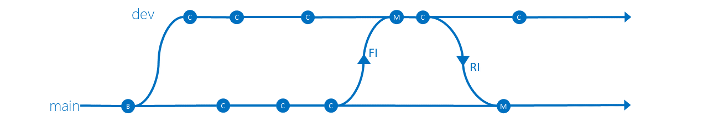
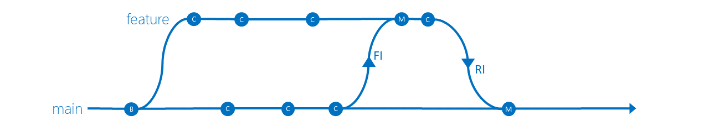
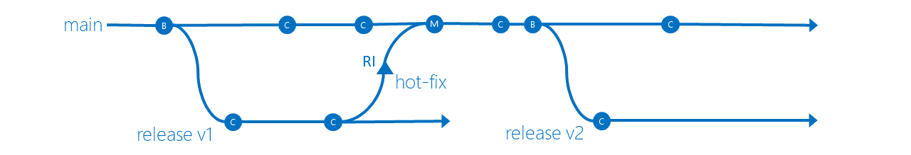
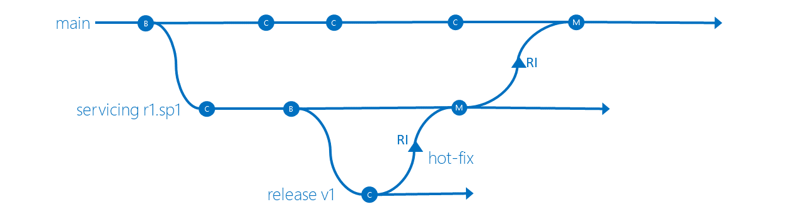

# Source code version control

## Introduction

- Helps developers create & maintain versions for their source code.
- Developers can collaborate on code & track changes
- Required for any development project.
- `git` is most commonly used.
- Azure DevOps has Azure Repos that support `git` and Team Foundation Version Control.
- Flow
  - Each developer has their own copy
  - They make changes
  - Push their changes into central repository
  - Other developers pull changes into their repositories
- If developer makes changes to same line of code it results in conflict.
  - Other developers must resolve the conflict.
  - Other solution: **Locking**
    - Single developer locks a part of the code.
    - Other developers cannot work on the locked part of the code.
    - Git does not provide any locking functionality, since it is decentralized
      - [`git lfs`](https://github.com/git-lfs/git-lfs/) that's supported by some git providers like GitHub supports [File Locking](https://github.com/git-lfs/git-lfs/wiki/File-Locking)
    - Centralized solutions such as SVN & ClearCase supports it.

## Centralized vs Decentralized repositories

- In a centralized repository like `SVN` everyone commits to a single repository.
  - If you lose server without backups, then everything is gone
- In a decentralized repository like `git` everyone commits to their own local copy (repository) of the remote repository and then pushes their changes to the remote repository.
  - You can work offline, as you don't need network to e.g. diff, check history, commit ,merge, switching branches, obtaining other revisions of a file

## Version Control Systems

| name | type | license | description | Azure Repos support | Terminology |
| ---- | --- | ------- | ------------ | :------------------: | -- |
| **git** | distributed | open-source | most popular, a lot tooling | ✔️ | pull & push |
| **TFVC** | centralized | proprietary | branches = paths, granular permissions down to a file level | ✔️ | check-in & check-out |
| **mercurial** | distributed | open-source | used by .eg. Facebook & Mozilla, simpler than GIT | ❌ | pull & push |
| **svn** (apache subversion) | centralized | open-source | branches = paths, granular permissions down to a file level | ❌ | commit & update |
| **Helix Core** (Perforce) | centralized | proprietary | branches = paths, granular permissions down to a file level | ❌ | check-in & check-out |
| **ClearCase** | centralized | proprietary | file-based architecture (where everything happens e.g. tagging at the file level) | ❌ |

## Central source code repository

- Git is distributed where each developer has own copy of the repository
  - so who has the master?
- Many teams uses centralized Git model
  - Possible to setup a Git server to host the repositories, but then maintenance is needed
  - or there are e.g. GitHub, Atlassian, Azure Repos on internet.

### Team Foundation Version Control

- 💡 In Azure DevOps: Choose TFVC for granular permissions on branch (=path) level, otherwise use GIT.
- [Types](https://docs.microsoft.com/en-us/azure/devops/repos/tfvc/branching-strategies-with-tfvc?view=azure-devops#main-only)
  - **Main Only** - commit your changes to the main branch and optionally indicate development and release milestones with tags
    - 
    - ❗ The mutability and lack of history with TFVC labels can add risk of change control.
  - **Development isolation**
    - Have stable **main** branch, you can branch one or more **dev** branches from **main**
    - Enables isolation and concurrent development
    - 
  - **Feature isolation**
    - Special derivation of the development isolation
    - Branch one or more feature branches from **main**, as shown, or from your **dev** branches
    - 
  - **Release isolation**
    - Introduces one or more **release** branches from **main**
      - Never forward integrate (FI) from **main**.
      - Patches and hot fixes made to the **release** can be reverse integrated (RI) back to the **main**.
    - 
  - **Servicing and Release isolation**
    - Allows e.g. service packs
    - release branch should never be modified
    - Never forward integrate from **main** to **servicing**, and **servicing** to **release**.
    - Altough not recommended, you can continue to evolve by introducing e.g. **hotfix** branches to releases=> **Servicing, Hotfix, Release isolation**
    - 
