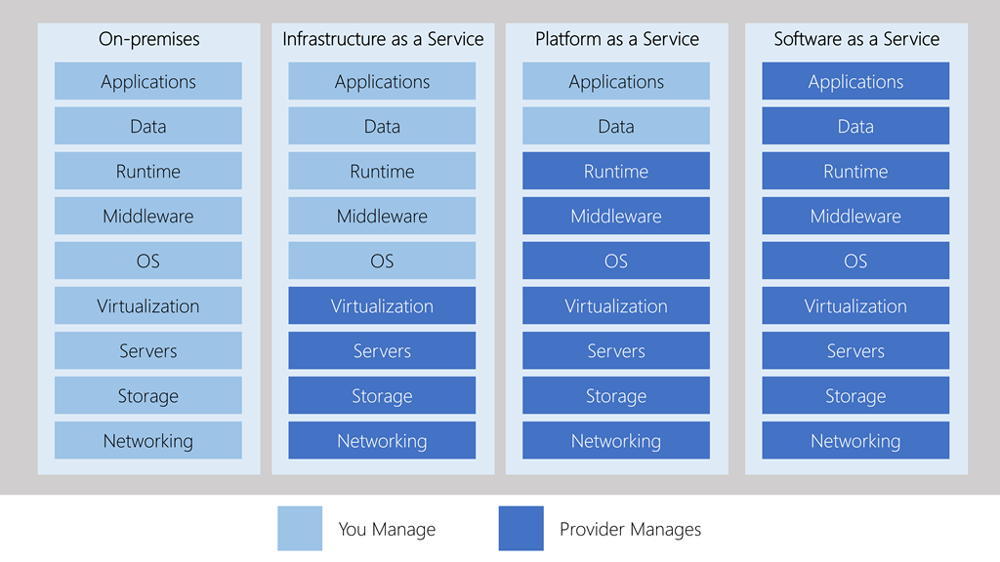

# IaaS vs PaaS vs SaaS

## Three categories of cloud computing

- 📝 [IaaS](#infrastructure-as-a-service-iaas), [PaaS](#platform-as-a-service-paas), [SaaS](#software-as-a-service-saas)
- You may easily use a combination of these types of infrastructure.
  - E.g. Office 365 on your company's computers (SaaS), VMs (IaaS) on Azure and Azure SQL Database (PaaS) to store your data.

### Infrastructure as a service (IaaS)

- Instant computing infrastructure, provisioned and managed over the internet.
- Aims to give you the most control over the provided hardware that runs your application
- 📝 E.g. virtual machines (VMs), storage, and operating systems.
- You rent hardware instead of buying
- Ensuring that a service is up and running is a shared responsibility (see [shared responsibility model](./4.1.%20Shared%20Responsibility%20Model.md))
  - cloud provider ensures the cloud infrastructure is functioning correctly
  - cloud customer ensures the service they are using is
    - configured correctly
    - up to date
    - available to their customers.

#### Common IaaS use cases

- **Migrating workloads**: Managed similar to on-prem infrastructure & provides easy migration path.
- **Test and development**: Teams can quickly set-up & dispose test/dev environments with fast & economical scaling.
- **Storage, backup and recovery**: Organizations avoid the capital outlay and complexity of storage management.
  - Useful for managing unpredictable demand and steadily growing storage needs.
  - can also simplify the planning and management of backup and recovery systems.

### Platform as a service (PaaS)

- Provides an environment for building, testing, and deploying software applications
  - Can add features such authentication.
- Aims to help creating an application quickly without managing the underlying infrastructure.
  - 📝 E.g. for a web app / Azure SQL databases you don't need to install an operating system, web server, or even system updates.
- Resources are purchased on a pay-as-you-go basis and accessed over a secure Internet connection.

#### Common PaaS use cases

##### Development framework

- Lets developers create applications using built-in software components.
- 📝 Cloud features such as scalability, high-availability, and multi-tenant capability are included
- Reducing the amount of coding that developers must do.

##### Analytics or business intelligence

- Tools provided as a service with PaaS allow organizations to analyze and mine their data.
- They can find insights and patterns, and predict outcomes to improve business decisions such as forecasting, product design, and investment returns.

### Software as a service (SaaS)

- Software that is centrally hosted and managed for the end customer.
- Usually based on an architecture where one version of the application is used for all customers
- Usually licensed through a monthly or annual subscription
- 📝 E.g. Office 365, Skype, and Dynamics CRM Online.

## Cost and Ownership

| | IaaS | PaaS | SaaS |
| -- | --- | --- | --- |
| Upfront costs | None, pay for what you use | None, pay for what you use | None, monthly / annual subscription |
| User ownership | purchase, installation, configuration, and management of their own software, operating systems, middleware, and applications | development of their own applications | not responsible for any maintenance or management of that software. |
| Cloud provider ownership | underlying cloud infrastructure (such as virtual machines, storage, and networking) is available for the user. | operating system management, network, and service configuration.. typically everything except user application | provision, management, and maintenance of the application software |

## Management responsibilities

- These categories are layers on top of each other
  - Abstraction order: SaaS > PaaS > IaaS
  - Abstraction = Hide details, quicker production but less control over the underlying hardware.
- IaaS: user is responsible for managing the operating systems, data, and applications.
- PaaS: user is responsible for the applications and data they run and store.
- SaaS: user just uses the software.

