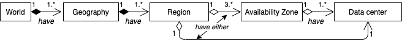
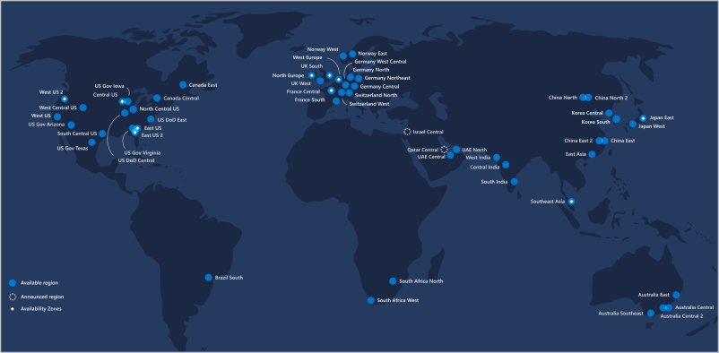

# Azure Data Centers

- Azure provides more than 100 redundant & secure facilities worldwide linked with a network.
  - Allows you to
    - gain global reach with local presence
    - keep your data secure and compliant with local laws
- 
- You can pick the region and sometimes availability zone you want resources deployed into.
  - ❗You can't select a specific datacenter or location within a datacenter.

## Regions

- Regions = Contains at least one, but often multiple datacenters that are nearby and networked together with a low-latency network.
  - Azure assigns and controls the resources within each region to ensure workloads are appropriately balanced.
  - E.g. West US, Canada Central, West Europe, Australia East, and Japan West.
- ❗Some services or virtual machine features are only available in certain regions, such as specific virtual machine sizes or storage types.
- Azure regions as of February 2020:
  - 
- 💡Regions provide better scalability, redundancy, and preserves data residency for your services.
- Read more: [Azure regions](https://azure.microsoft.com/en-us/global-infrastructure/regions/)

### Special regions

- For compliance or legal purposes.
- **Azure Government**
  - ***US DoD Central***, ***US Gov Virginia***, ***US Gov Iowa*** and more
  - 📝 Physical and logical network-isolated instances of Azure for US government agencies and partners.
- ***China East***, ***China North*** and more
  - Unique partnership between Microsoft and 21Vianet
  - Microsoft does not directly maintain the datacenters.

## Geographies

- Each region belongs to a single *geography*
- Defined by geopolitical boundaries or country borders.
- Has specific service availability, compliance, and data residency/sovereignty rules applied to it
- Fault-tolerant to withstand complete region failure through their connection to dedicated networking infrastructure
  - 📝 **Fault-tolerance**: App ability to self-detect and correct all types of problems in its environment
- **Data residency**
  - Defines the legal or regulatory requirements imposed on data
  - Based on the country or region in which it resides
  - 💡 An important consideration when planning out your application data storage.
- Geographies are broken up into the following areas
  - Americas
  - Europe
  - Asia Pacific
  - Middle East and Africa
- Read more: [Azure geographies](https://docs.microsoft.com/en-us/learn/modules/explore-azure-infrastructure/9-summary)

## Availability Zones

- 📝 Physically separate datacenters within an Azure region.
- 💡 Allows you to make applications highly available through redundancy.
  - Replicate your compute, storage, networking, and data resources in other zones.
  - Costs more
  - Primarily for VMs, managed disks, load balancers, and SQL databases
  - **Zonal services**: Pin resource to a specific zone.
  - **Zone-redundant services**: Replicates automatically across zones.
- Have independent power, cooling, and networking
- Set up to be an ***isolation boundary***
  - If one zone goes down, the other continues working
- Identified as 1-2-3
  - Logically mapped to the actual physical zones for each subscription independently.
  - Availability Zone 1 in a given subscription might refer to a different physical zone than Availability Zone 1 in a different subscription.
- Connected through high-speed, private fiber-optic networks.
- ❗There are regions that do not support (multiple) availability zones

## Region Pairs

- Each Azure region is always paired with another region within the same geography
  - E.g. West US paired with East US, and South East Asia paired with East Asia
- Pairs are at least 300 (≈ 500 km) miles away.
- Allows for the replication of resources, e.g. virtual machine storage
  - Some services offer automatic geo-redundant storage using region pairs.
- Reduce the likelihood of interruptions to both regions
  - E.g. natural disasters, civil unrest, power outages, or physical network outages
- If one region fails, services automatically fail over to the other region in its region pair.
- Data continues to reside within the same geography as its pair (except for Brazil South) for tax and law enforcement jurisdiction purposes.
- If there's an extensive Azure outage =>
  - One region out of every pair is prioritized to make sure at least one is restored as quick as possible,
- Planned Azure updates are rolled out to paired regions one region at a time to minimize downtime and risk of application outage.
