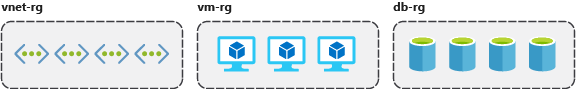
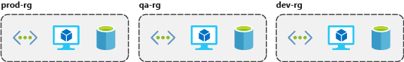
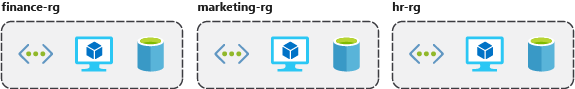
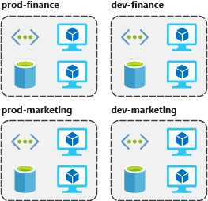
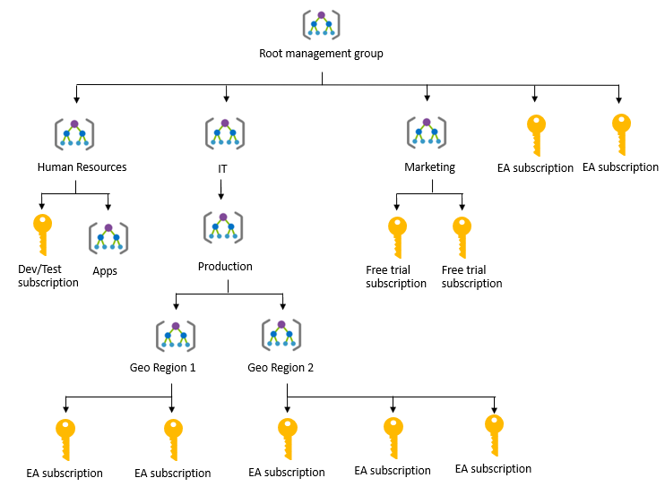

# Azure Resource Manager (Resources & Resource Groups & Management Groups)

## Azure Resource

- Anythings you create in an Azure subscription
- E.g. virtual machines, Application Gateways, and CosmosDB instances
- 💡 Good to have consistent naming convention e.g.: `cloudarchitecture-prod-infrastructure-rg`
  - what it's used for (`cloudarchitecture`)
  - environment (`prod`)
  - the types of resources contained within (`infrastructure`)
  - type of resource it is itself (`rg` = resource group)
- Provides fine-grained access management through [role-based access control (RBAC)](./4.4.%20Identity%20and%20Access%20(Azure%20AD).md#role-based-access-control)
- 📝 You can move some resources that supports move to a new resource group or subscription if they [support move operation](https://docs.microsoft.com/en-us/azure/azure-resource-manager/resource-group-move-resources).

### Tagging

- Helps you better search, filter, and organize these resources
- Name/value pairs of text data that you can apply to resources and resource groups
- E.g.
  - department (like finance, marketing, and more)
  - environment (prod, test, dev)
  - cost center
  - life cycle and automation (like shutdown and startup of virtual machines)
- 💡📝 Good way to group your billing data
  - E.g. VMs on production that belongs to a cost center A.
- 💡 Help with monitoring
  - You can set-up alerts based on tags e.g. if a resource fails notification goes to the finance department.
- 💡 Help with automation
  - E.g. `shutdown:6PM` and `startup:7AM` tag TO automate the shutdown and startup of virtual machines in development environments during off-hours to save costs.
- 💡 Help with automation Governance through [Policies](./5.1.%20Azure%20Policy%20&%20Azure%20Blueprints.md)
  - E.g. ensure that all resources have the Department tag associated with them and block creation if it doesn't exist.
- ❗ Limitations:
  - A resource can have up to 50 tags.
  - 📝 Tags aren't inherited from parent resources.
  - 📝 Not all resource types support tags

### Resource locks

- 📝 Blocks modification (**Read-only**) or deletion (**Delete**) of the resource.
  - For more granular control of what can be deployed e.g. see [Azure policies](./5.1.%20Azure%20Policy%20&%20Azure%20Blueprints.md#azure-policy)
- Read-only allows only `HTTP GET` requests
  - ❗ Can lead to unexpected results e.g. listing all objects in a storage account requires `POST` request is denied
- 📝 You must remove the lock in order to perform forbidden activity.
- Apply regardless of RBAC permissions
- 📝 Protects against accidental deletion
- 💡 Use to protect key resources that could have a large impact if they were removed or modified
  - E.g. ExpressRoute circuits, virtual networks, critical databases, and domain controllers
- Only "Owner" and "User Access Administrator" can create/delete locks
  - It requires access to `Microsoft.Authorization/locks/*`

## Azure Resource Group

- Also an Azure resource so it can have locks, tags, RBAC permissions etc.
  - It's free!
- Logical container for resources deployed on Azure.
- Tied to a region & subscription itself.
  - 📝 But can contain resources from different regions
    - ❗If region the RG goes down, the management of the RG would not work.
- Helps you organize resources
  - You can place resources of e.g. similar usage, type, or location in same group.
- 📝 If you delete a resource group, all resources contained within are also deleted.
- Authorization
  - Scope for applying role-based access control (RBAC) permissions.
  - Permissions are inherited in all resources that the group has.
- ❗ All resources must be in a resource group and a resource can only be a member of a single resource group.
  - Before any resource can be provisioned, you need a resource group
- ❗ Some services has specific limitations or requirements to move from one resource group to another
- ❗ Can't be nested.
- Can see history of the deployments to a resource group

### Organizing resource groups

- By type (virtual networks, virtual machines, cosmos dbs)
  - 
- By environment (prod, qa, dev)
  - 
- By department (marketing, finance, human resources)
  - 
- Combining strategies e.g. environment and department:
  - 
- By authorization
  - By who needs to administer them.
  - See [RBAC](./4.4.%20Identity%20and%20Access%20(Azure%20AD).md#role-based-access-control)
  - E.g. databases in database administration group to give access to database administrators.
- By life cycle
  - Allows you to e.g. delete after experimentation.
- By billing
  - A way to filter and sort the data to better understand where costs are allocated.

## Management Groups

- 📝 Groups multiple subscriptions.
- 📝 Can have RBAC assignments and policies
  - Inherited by underlying subscriptions
- Good for enterprises
- E.g.
  - 
