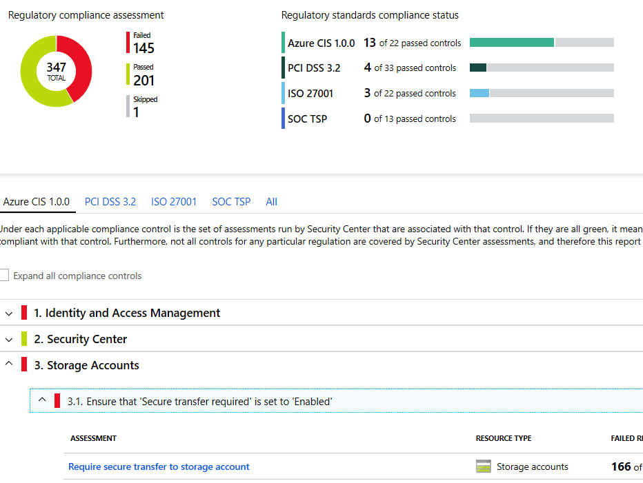

# Compliance in Azure

## Microsoft Privacy Statement

- [privacy.microsoft.com/privacystatement](https://privacy.microsoft.com/en-us/privacystatement)
- 📝 Explains what personal data Microsoft processes, how Microsoft processes it, and for what purposes.
- Applies to the interactions Microsoft has with you and Microsoft products such as Microsoft services, websites, apps, software, servers, and devices.

## Microsoft Trust Center

- [microsoft.com/trust-center](https://www.microsoft.com/trust-center)
- 📝 In-depth information about security, privacy, compliance offerings, policies, features, and practices across Microsoft cloud products.
- Recommended resources in the form of a curated list of the most applicable and widely used resources for each topic.
- Direct guidance and support

## Service Trust Portal

- [servicetrust.microsoft.com](https://servicetrust.microsoft.com/)
- 📝 Can download
  - audit reports produced by external auditors
  - Microsoft-authored reports about its cloud services.
- Also has compliance guides to help you understand how you can use Microsoft cloud service features to manage compliance with various regulations.
- Hosts [Compliance Manager](#compliance-manager), companion feature to the [Trust Center](#microsoft-trust-center).

### Compliance Manager

- [servicetrust.microsoft.com/ComplianceManager](https://servicetrust.microsoft.com/ComplianceManager)
- Free workflow-based risk assessment dashboard with
  - summary of your data protection, compliance stature, recommendations for improvement
- Features:
  - Combines the following three items:
    1. Information provided by Microsoft to auditors and regulators e.g.ISO 27001, ISO 27018, and NIST.
    2. Information that Microsoft compiles internally for its compliance with regulations (such as HIPAA and the EU GDPR).
    3. An organization's self-assessment of their own compliance with these standards and regulations.
  - Repository in which to upload and manage evidence and other artifacts related to compliance activities.
  - Assign, track, and record compliance and assessment-related activities
    - Help your organization cross team barriers to achieve your organization's compliance goals.
  - ***Compliance Score*** to help you track your progress with onging risk assessments.
    - Recommends also actions as part of the risk assessment.
  - Excel reports that document the compliance activities performed by Microsoft and your organization.
    - 💡 Can be provided to auditors, regulators, and other compliance stakeholders

## Azure Security Center

- 📝 Global service in Azure that includes regulatory compliance dashboard of **your** services.
- Insights into your compliance posture based on continuous assessments
- Analyzes risk factors in your hybrid cloud environment according to security best practices
- Overall security score, assessment against e.g. CIS, PCI DSS 3.2.1, SOC, ISO 27001..
- 
