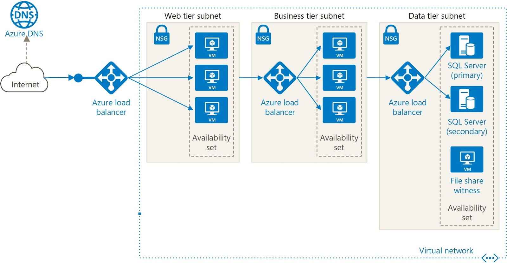

# Networking

## Loosely Coupled Architecture

- Architecture behind Azure
- Different services/components that sends and receives data from one another
  - They have little to no knowledge about other components.
- See also [micro-services](./3.1.2.%20Containers.md#micro-services).
- 💡 Recommended because:
  - Can be updated independently: Allows non-breaking changes as long as communication strategy is consistent.
  - Allows services to be changed without significant impact to the rest of the system.
  - Can be scaled proportionally.
    - Scale up/down, out/in only services that are relevant.
    - 💡 Take advantage of asynchronous messaging in Azure for communication for scalability.

### N-tier architecture

- Can be used to build loosely coupled architectures.
- Divides an application into two or more logical tiers.
  - A higher tier can access services from a lower tier, but a lower tier should never access a higher tier.
- Tiers help separate concerns and are ideally designed to be reusable.
- Simplifies maintenance: Tiers can be updated or replaced independently, and new tiers can be inserted if needed.
- *Three-tier* refers to an *n-tier* application that has three e.g.
  - Web tier (front-end)
  - Application tier (back-end that runs application logic)
  - Data tier (database)
  - 
    - Observe that each tier can access services only from a lower tier.
- [Read more](https://docs.microsoft.com/sv-se/azure/architecture/guide/architecture-styles/n-tier)

## Concepts

### Region

- One or more Azure data centers within a specific geographic location
- E.g. East US, West US, and North Europe

### Virtual Network

- Enable you to group and isolate related systems
- Logically isolated network on Azure
- Allows Azure resources to securely communicate with each other, the internet, and on-premises networks
- ❗ Scoped to a single region
- 💡📝 Virtual networks, subnets, NICs (network interfaces) are free (no $$) resources
  - Public IP addresses, reserved IP, network appliances such as VPN Gateway & Application Gateway are charged.
- You choose which networks your virtual network can reach, whether that's the public internet or other networks in the private IP address space.

#### Subnet

- A virtual network can be segmented into one or more subnets.
- Help you organize and secure your resources in discrete sections.
- E.g. users interact with the web tier directly, so that VM has a public IP address along with a private IP address.
  - Users don't interact with the application or data tiers, so these VMs each have a private IP address only.

#### VPN Gateway

- 📝 Also called **virtual network gateway**
- 📝 Provide a secure connection between an Azure Virtual Network and an on-premises location over the internet.
- 📝 Your on-premises network is represented as **Local network gateway** object in Azure.
- E.g. enables you to keep your data tiers in on-premises network, and web tier in cloud.
- Azure manages the physical hardware for you, virtual networks & gateways are configured through software.
- 📝❗ Must be deployed in a subnet called gateway subnet.

### Network security group (NSG)

- 📝 Control what traffic can flow through a virtual network.
- Allows or denies inbound network traffic to your Azure resources.
- Can be thought as a cloud-level firewall for your network.
- E.g. web tier allows inbound traffic on ports 22 (SSH) and 80 (HTTP).
  - Port 22 enables you to connect directly to Linux systems over SSH.
    - You might configure VPN access to your virtual network to increase security.
- 💡 Configure a NSG to accept traffic only from known sources, such as IP addresses that you trust.
