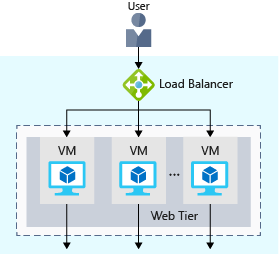

# Load Balancing

- Increases availability & resiliency
  - **Availability**: to how long your service is up and running without interruption
    - High availability (HA), or highly available = a service that's up and running for a long period of time.
    - Five nines availability: Guaranteed to be running 99.999 percent of the time
  - **Resiliency** refers to a system's ability to stay operational during abnormal conditions e.g.
    - Natural disasters, system maintenance, spikes in traffic, threats made by malicious parties
- Load balancer distributes traffic evenly among each system in a pool.
  - The idea is to have additional systems ready, in case one goes down or serving too many users.
- The load balancer becomes the entry point to the user.
  - The user doesn't know (or need to know) which system the load balancer chooses to receive the request.
- 
  - If a VM is unavailable or stops responding, the load balancer stops sending traffic to it.
- In 3-tier architecture, the app and data tiers can also have a load balancer. It all depends on what your service requires.
- You can configure your own load balancer on a VM, or use [Azure Load Balancer](#azure-load-balancer), [Azure Application Gateway](#azure-application-gateway), [Content Delivery Network](#azure-content-delivery-network) or [Azure Traffic Manager](#azure-traffic-manager).

## Azure Load Balancer

- Microsoft does the maintenance for you.
  - There's no infrastructure or software for you to maintain
- Define the forwarding rules based on the source IP and port to a set of destination IP/ports.
- Supports inbound and outbound scenarios (internal + external load balancer)
- Provides low latency and high throughput
  - 📝 **Low latency**: computer network that is optimized to process a very high volume of data messages with minimal delay (latency).
- Scales up to millions of flows for all Transmission Control Protocol (TCP) and User Datagram Protocol (UDP) applications
- Use-cases:
  - incoming internet traffic
  - internal traffic across Azure services
  - port forwarding for specific
  - 💡 Outbound connectivity for VMs in your virtual network

## Azure Application Gateway

- 💡Better option if all of your traffic HTTP.
- Load balancer designed for web applications
  - It's application layer (OSI layer 7) load balancing since it understands the structure of the HTTP message.
- It uses Azure Load Balancer at the transport level (TCP) behind the scenes.
- Functionalities:
  - **Cookie affinity**
    - Useful when you want to keep a user session on the same backend server.
  - **SSL termination**
    - Can manage your SSL certificates and pass unencrypted traffic to the backend servers to avoid encryption/decryption overhead.
    - Full end-to-end encryption for applications that require that.
  - **Web application firewall**
    - Supports a sophisticated firewall (WAF) with detailed monitoring and logging to detect malicious attacks against your network infrastructure.
  - **URL rule-based routes**
    - Route traffic based on URL patterns, source IP address and port to destination IP address and port.
    - Helpful when setting up a [content delivery network](#azure-content-delivery-network).
  - **Rewrite HTTP headers**
    - Addadd or remove information from the inbound and outbound HTTP headers of each request to enable important security scenarios, or scrub sensitive information such as server names.

## Azure Content Delivery Network

- Caches content at nodes across the world and provide better performance to end users.
- Allows distributed network of servers that can efficiently deliver web content to users to minimize latency.
- Can be hosted in Azure or any other location.
- 💡 Use-cases:
  - web applications containing multimedia content
  - a product launch event in a particular region,
  - or any event where you expect a high-bandwidth requirement in a region.

### DNS

- DNS, or Domain Name System, is a way to map user-friendly names to their IP addresses.
  - E.g. contoso.com might map to IP address of the load balancer at the web tier, `40.65.106.192`.
- You can bring your own DNS server or use [Azure DNS](#azure-dns)

#### Azure DNS

- A hosting service for DNS domains that runs on Azure infrastructure.
- Provides ultra-fast DNS responses and ultra-high domain availability

## Azure Traffic Manager

- DNS based traffic load balancer
- Allows you to make e.g. your website located in the United States, load faster for users located in Europe or Asia.
- Uses the DNS server that's closest to the user to direct user traffic to a globally distributed endpoint.
- It directs the client web browser to a preferred endpoint.
- Can route traffic in a few different ways, using e.g. to the endpoint with the lowest latency.
- You can connect Traffic Manager to your own on-premises networks.

### Network latency

- 📝 The time it takes for data to travel over the network.
- Typically measured in milliseconds.
- Bandwidth vs Latency
  - Bandwidth = the amount of data that can fit on the connection.
  - Latency = the time it takes for that data to reach its destination.
- Affected by factors such as:
  - type of connection you use
  - how your application is designed
  - biggest factor = distance
- One way to reduce latency is to provide exact copies of your service in more than one region using Azure Traffic Manager.

## Load Balancer vs Azure Traffic Manager

- Azure Load Balancer distributes traffic within the same region.
  - Traffic Manager works at the DNS level, and directs the client to a preferred endpoint across regions.
- Both help with resiliency in different ways.
  - Load Balancer detects an unresponsive VM => it directs traffic to other VMs in the pool.
  - Traffic Manager monitors the health of your endpoints, finds an unresponsive endpoint => it directs traffic to the next closest endpoint that is responsive.
