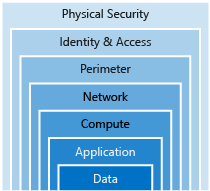

# Defence in Depth

- Strategy to slow the advance of an attack to get unauthorized access to information.
- Layered approach: Each layer provides protection, so if one layer is breached, a subsequent prevents further exposure.
- Applied by Microsoft, both in physical data centers and across Azure services.

## Layers

- 

### Data

- In almost all cases attackers are after data.
- Data can be in database, stored on disk inside VMs, on a SaaS application such as Office 365 or in cloud storage.
- Those storing and controlling access to data to ensures that it's properly secured
- Often regulatory requirements dictates controls & processes
  - to ensure confidentiality, integrity, and availability.

### Application

- Ensure applications are secure and free of vulnerabilities.
- Store sensitive application secrets in a secure storage medium.
- Make security a design requirement for all application development.
- Integrate security into the application development life cycle,

### Compute

- Secure access to virtual machines.
- Implement endpoint protection and keep systems patched and current.
  - Malware, unpatched systems, and improperly secured systems open your environment to attacks.

### Networking

- Limit communication between resources.
- Deny by default.
  - Allow only what is required
- Restrict inbound internet access and limit outbound, where appropriate.
- Implement secure connectivity to on-premises networks.

### Perimeter

- Use distributed denial of service (DDoS) protection to filter large-scale attacks before they can cause a denial of service for end users.
- Use perimeter firewalls to identify and alert on malicious attacks against your network.

### Identity and access

- Control access to infrastructure and change control.
- Access granted is only what is needed
- Use single sign-on and multi-factor authentication.
- Audit events and changes.

### Physical security

- Building security & controlling access to computing hardware.
- First line of defense
