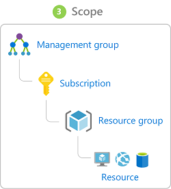

# Identity and Access (Azure AD)

- Old-school corporate security
  - Network perimeters, firewalls, and physical access controls
  - Does not work good with bring your own device (BYOD), mobile apps, and cloud applications.
- Identity = new primary security boundary
  - Proper authentication and assignment of privileges is critical to maintaining control of your data.
  - Allows to maintain a security perimeter outside physical control
  - Possible to always be sure who has the ability to see & manipulate data and infrastructure with [single sign-on](#single-sign-on) and appropriate [role-based access](#role-based-access-control) configuration.

## Authentication and authorization

- Azure provides services to manage both through [Azure Active Directory](#azure-active-directory)

### Authentication

- 📝 Verification of a person or service looking to access a resource.
  - Establishes if they are who they say they are.
- Challenges a party for legitimate credentials, and provides the basis for creating a security principal for identity and access control use.
- Sometimes called az **AuthN**.

### Authorization

- 📝 Establishes what level of access an authenticated person or service has.
- Specifies what data they're allowed to access and what they can do with it.
- Sometimes shortened to **AuthZ**.

## Azure Active Directory

- Called also as **Azure AD**.
- Cloud-based identity service.
- Can synchronize with existing on-premises Active Directory or can be used stand-alone.
- Allows to share identities in cloud (e.g. Office 365), mobile on-premises applications.
- ❗📝 No SLA for free tier, 99.9% for standard & premium
- Some services:
  - **Authentication**.
    - Self-service password reset
    - [Multi-factor authentication (MFA)](#multi-factor-authentication)
    - Custom banned password list, and smart lockout services.
  - **[Single-Sign-On (SSO)](#single-sign-on)**
  - **Application management**. Manage cloud and on-premises apps using Azure AD Application Proxy, SSO, the My apps portal (also referred to as Access panel), and SaaS apps.
  - **Business to business (B2B) identity services**: Manage guest users and external partners.
  - **Business-to-Customer (B2C) identity services**: Customize and control how users sign up, sign in, and manage their profiles when using apps & services.
  - **Device Management**
    - Manage how your cloud or on-premises devices access your corporate data.

### Single sign-on

- More identities for single user
  - = more passwords & harder for users to remember them
  - = more risk of credential-related security incident
  - = harder management: more account lockouts and password reset requests
    - if a user leaves an organization = all identities must be tracked down
- Single sign-on (SSO) = single identity
  - = one password to access across all applications
  - 📝 less effort to manage e.g. if someone leaves an organization
- 📝 Allows you to use third-party e.g. on-prem identities in Azure.

#### SSO with Azure Active Directory

- Ability to combine data sources into an intelligent **security graph**.
  - Graph enables the ability to
    - provide threat analysis
    - real-time identity protection
- Applied to all accounts in Azure AD (can be synchronized from on-prem).
- Centralized identity provider is good
  - centralized security controls, reporting, alerting, and administration of the identity infrastructure.
- E.g. allows signing into email and Office 365 documents without having to reauthenticate.

### Multi-factor authentication

- Called also MFA
- Requires two or more elements for full authentication.
  - Element categories:
    - **Something you know**
      - E.g. a password or the answer to a security question
    - **Something you possess**
      - E.g. a mobile app that receives a notification or a token-generating device
    - **Something you are**
      - E.g. a fingerprint or face scan used often on mobile devices.
- 💡 Enable it wherever possible for more security.

#### Azure AD MFA

- Integrates also with  other third-party MFA providers.
- 💡 Always use at least for Global Administrator role in Azure AD.
- 📝 You can activate conditionally using **Azure AD Identity Protection**
  - E.g. any time a user is signing in from an unknown computer.

### Providing identities to services

- Valuable for services to have identities
- Often, and against best practices, credential information is embedded in configuration files.
  - With no security around these configuration files, anyone with access to the systems or repositories can access these credentials and risk exposure.

#### Service identities in Azure AD

##### Service principals

- **Identity**: A thing that can be authenticated.
  - e.g. users with user name + password
  - e.g. applications or other servers with secret keys or certificates.
- **Principal**: an identity acting with certain roles or claims
  - You can have same identity but different role which you are executing.
    - E.g. running `sudo` on a Bash prompt or on Windows using "run as Administrator."
  - Groups are often also considered principals because they can have rights assigned.
- **Service principal** = an identity that is used by a service or application that can be assigned roles.

##### Managed identities

- Azure infrastructure automatically takes care of authenticating the service and managing the account.
- Can be instantly created for any Azure service that supports it
- Allows the authenticated service secure access of other Azure resources just like any AD account.

### Roles in Azure

- All co-exists.
- Three categories: [classic roles](#classic-roles), [azure roles](#role-based-access-control), [azure ad roles](#azure-ad-roles)

#### Classic roles

- 📝 Before [Role-based access control](#role-based-access-control) was introduced there were 3 roles:
  - **Account Administrator**: ❗ One per Azure account
  - **Service Administrator**:❗ One per Azure subscription
  - **Co-Administrator**: ❗ 200 per subscription

### Role-based access control

- Called also **Azure roles**.
- 📝 Provides fine-grained access management for Azure resources
- **Role**
  - Sets of permissions
  - E.g. "Read-only" or "Contributor"
  - Identities are mapped to roles directly or through group membership.
- **Role assignments**
  - When you are assigned to a role, RBAC allows you to perform specific actions, such as read, write, or delete.
  - E.g.
    - Allow one user to manage VMs in a subscription
    - Allow an application to access all resources in a resource group.
- Can be granted at the service instance level, but they also flow down the Azure Resource Manager hierarchy.
  - Roles assigned at a higher scope, like an entire subscription, are inherited by child scopes, like service instances.
  - 
- 💡 Segregate duties within your team and grant only the amount of access to users that they need to perform their jobs.
- Four fundamental Azure roles: **Owner**, **Contributor**, **Reader**, **User Access Administrator**

### Azure AD Roles

- On-tenant level
- **Global Administrator**: Person who signs up for Azure AD tenant, can do anything.
- Also **User Administrator**, **Billing Administrator**

#### Privileged Identity Management

- Also known as **Azure AD Privileged Identity Management (PIM)**
- Includes ongoing auditing of role members
  - needed as their organization changes and evolves.
- Provides:
  - Oversight of role assignments
  - Self-service
  - Just-in-time role activation
  - Azure AD and Azure resource access reviews.
