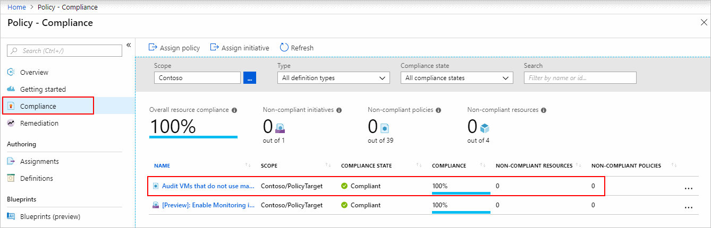

# Azure Policy & Azure Blueprints

- Allows you to ensure standards are followed for all IT allocated resources.
- Old way was having the IT team define and deploy all cloud-based assets
  - Bad: reduces the team agility and ability to innovate
  - Instead: enforce and validate your standards while still team(s) to create and own their own resources in the cloud.

## Azure Policy

- Each policy enforces rules over specified or all resources.
- 📝 Allows your infrastructure stays compliant with e.g.
  - corporate standards, cost requirements, service-level agreements.
- E.g. a policy that allows virtual machines of only a certain size in your environment.
- Evaluates both new and existing resources for compliance.
  - Can deny new uncompliant resources from being created
  - Can stop existing resources from being updated to an uncompliant state.
    - 📝❗ Does not remove uncompliant resources!
  - Can only audit existing & new resources
    - Identifying non-compliant resources
    - 
  - Can alter the resource properties.

### Azure Policy vs RBAC

- RBAC focuses on user actions at different scopes.
  - e.g. the contributor role for a resource group allows contribution to a resource group
- Azure Policy focuses on resource properties
  - both during deployment and for already-existing resources.
- Azure Policy controls properties such as the types or locations of resources.
- Unlike RBAC, Azure Policy is a **default-allow-and-explicit-deny system**.

### Creating a policy

1. Create a [policy definition](#policy-definition)
2. Assign a definition to a [scope](#policy-scope) of resources
3. View policy evaluation results

### Policy Definition

- What to evaluate and what action to take
- Has
  - conditions under which it is enforced
  - accompanying effect that takes place if the conditions are met
- E.g. restrict the locations that your organization can specify when deploying resources
- Represented as a JSON file, many [samples on GitHub](https://github.com/Azure/azure-policy)
  - E.g. policy to only allow specific virtual machine sizes:

    ```jsonc
      {
        "if": {
          "allOf": [
            {
              "field": "type",
              "equals": "Microsoft.Compute/virtualMachines"
            },
            {
              "not": {
                "field": "Microsoft.Compute/virtualMachines/sku.name",
                "in": "[parameters('listOfAllowedSKUs')]" // replacement token that will be filled in when the policy definition is applied to a scope
              }
            }
          ]
        },
        "then": {
          "effect": "Deny"
        }
      }
    ```

#### Policy effects

- Create or update a resource through Azure Resource Manager are evaluated by Azure Policy first.
- Each policy definition in Azure Policy has a single effect
  - **Deny**: The resource creation/update fails due to policy.
  - **Disabled**: The policy rule is ignored (disabled). Often used for testing.
  - **Append**: Adds additional parameters/fields to the requested resource during creation or update.
    - E.g. adding tags
  - **Audit**, **AuditIfNotExists**: Creates a warning event in the activity log when evaluating a non-compliant resource, but it doesn't stop the request.
  - **DeployIfNotExists**: Executes a template deployment when a specific condition is met.
    - E.g. run new deployment if SQL is deployed to configure it.

### Policy Scope

- Determines what resources or grouping of resources the policy assignment gets enforced on.
- Range from a management group to resource groups.

### Policy Assignment

- [Policy definition](#policy-definition) that has been assigned to take place within a specific [scope](#policy-scope).
- Are inherited by all child resources
- You can exclude a subscope from the policy assignment.
  - e.g. enforce a policy for an entire subscription and then exclude a few select resource groups.
- ❗May take up to 30 minutes to take effect

### Policy Initiatives

- Allows you to organize one or multiple policies.
  - 💡 Recommended only for one policy if you anticipate increasing the number of policies over time.
- Helps you track your compliance state for a larger goal
- Simplify the process of managing and assigning policy definitions
  - E.g. initiative ***Enable Monitoring in Azure Security Center*** has policies:
    - ***Monitor unencrypted SQL Database in Security Center***
      - For monitoring unencrypted SQL databases and servers.
    - ***Monitor OS vulnerabilities in Security Center***
      - For monitoring servers that do not satisfy the configured baseline.
    - ***Monitor missing Endpoint Protection in Security Center***
      - For monitoring servers without an installed endpoint protection agent.

## Azure Blueprints

- Makes it easier to adhere to security or compliance requirements, whether government or industry requirements.
- Used often by cloud architects & central information technology groups.
- Azure Blueprints is a declarative way to orchestrating deployment of:
  - Role assignments
  - Policy assignments
  - Azure Resource Manager templates
  - Resource groups
- 💡 Useful in Azure DevOps scenarios as it makes automation easier.
- Implementation
  1. Create an Azure Blueprint
  2. Assign the blueprint
  3. Track the blueprint assignments
- Tracking and auditing: Observes relationship between the definition (what **should** be deployed) and the blueprint assignment (what **was** deployed)
- 🤗 Backed by the globally distributed Azure Cosmos database with replication.

### Azure Blueprints vs Resource Manager templates

- No need to choose between them & can use both.
  - Each blueprint can consist of zero or more Resource Manager template artifacts.
- Differences:

  | | Azure Blueprints | Resource Manager templates |
  |-|------------------|----------------------------|
  | Packages | resource groups, policies, role assignments, and Resource Manager template deployments | resource groups, policies, role assignments |
  | Storage | Natively in Azure | Either locally or in source control. |
  | Tracking | Observes what should be deployed and was deployed | There's no active connection/relationship from deployed resources to the template |
  | Deployment scope | Several subscription | Subscription or resource group |

### Azure Blueprints vs Azure Policy

- A policy is a default-allow and explicit-deny system focused on resource properties during deployment and for already existing resources.- A policy can be included as one of many artifacts in a blueprint definition.
- Blueprints also support using parameters with policies and initiatives.
