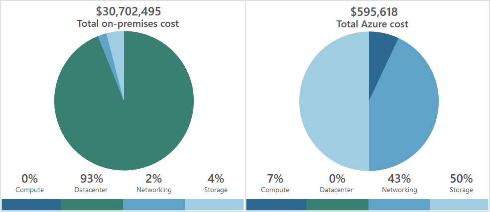
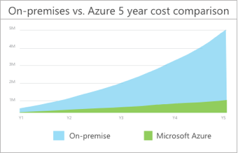

# Azure Costs & Tools

- There's always the challenge of balancing cost against performance.

## Usage meters

- 📝 Used to determine Azure costs for each billing period
- When you provision an Azure resource, Azure creates one or more meter instances for that resource.
  - They are charged based on usage
- The meters track the resources' usage, and generate a usage record that is used to calculate your bill.
- Each meter tracks a particular kind of usage.
- The usage that a meter tracks correlates to a number of **billable unit**s.
  - Those units are charged to your account for each billing period.
- E.g. when you deploy a single virtual machine:
  - Azure might have following meters tracking:
    - Compute Hours, IP Address Hours
    - Data Transfer In, Data Transfer Out
    - Standard Managed Disk, Standard Managed Disk Operations
    - Standard IO-Disk, Standard IO-Block Blob Read, Standard IO-Block Blob Write, Standard IO-Block Blob Delete
  - 📝❗If you de-allocate a VM you'll not pay for it. However, your persistent disks remain in your subscription that you pay for.
- Meters and pricing vary per product
- Often have different pricing tiers based on the size or capacity of the resource.

## Billing

- At the end of each monthly billing cycle:
  - the usage values are charged to your payment method
  - the meters are reset
- Check the billing page in the Azure portal:
  - summary of your current usage
  - any invoices from past billing cycles

## Factors affecting costs

### Resource type

- Costs are resource-specific
- The usage that a meter tracks and the number of meters associated with a resource depend on the resource type.
- The rate per billable unit depends on the resource type you are using.

### Services

- Enterprise, Web Direct, and Cloud Solution Provider (CSP) customers
- Azure usage rates and billing periods can differ between them.
- Some subscription types also include usage allowances, which affect costs.
- Different billing structure apply to products and services from third-party vendors are available in the [Azure Marketplace](https://azuremarketplace.microsoft.com/)

### Location

- Varies based on popularity, demand, and local infrastructure costs in a location.
- See [choose low cost locations and regions](./6.4.%20Cost%20Optimization%20Best%20Practices.md#choose-low-cost-locations-and-regions).

### Bandwidth

- Bandwidth = data moving in and out of Azure datacenters.
- 💡📝 Mostly inbound data (data to Azure) transfers are free.
  - Outbound data transfers (from Azure to outside) costs based on Billing Zones
    - Moving data between Azure regions counts as outbound data transfer.

#### Billing zone

- A Zone is a geographical grouping of Azure Regions for billing purposes.
- Each zone has different outbound data transfer prices.
- Zones:
  - Zone 1: United States, US Government, Europe, Canada, UK, France, Switzerland
  - Zone 2: East Asia, Southeast Asia, Japan, Australia, India, Korea
  - Zone 3: Brazil, South Africa, UAE
  - DE Zone 1: Germany.

## Tools

### Azure pricing calculator

- Free web-based tool: [https://azure.microsoft.com/en-us/pricing/calculator/](https://azure.microsoft.com/en-us/pricing/calculator/)
- Get estimate costs without deploying and running those services or without manually pricing out each service from the Azure service pricing pages.
  - 📝 Can save results in your Azure account, export as Excel or shared as an URL.
- You select Azure services and modify properties and options of the services.
  - Outputs the costs per service and total cost for the full estimate
  - Modifiable properties:
    - **Region**: E.g. Southeast Asia, central Canada, western United States, northern Europe...
    - **Tier**: E.g. Free Tier, Basic Tier, etc.
    - **Billing Options**: Per type of customers and subscriptions for a chosen product.
    - **Support Options**: Included / paid support options.
    - **Programs and Offers**: Available price offerings according to your customer or subscription type.
    - **Azure Dev/Test Pricing**: Available if subscription is based on a Dev/Test offer.
- On the pricing calculator page, you'll see several tabs:
  - **Products**. Lists all Azure services, 📝 allows you put together services for your estimate.
    - Customizable e.g. for VMs you select region, OS, size, running hours.
  - **Example Scenarios**. Common solutions to add all the components, e.g. VMs + load balancer.
  - **Saved Estimates**. Your previously saved estimates.
  - **FAQ**

### Azure Advisor

- Free service that provides recommendations on
  - 📝 high availability, security, performance, operational excellence, and cost.
- Analyzes your deployed services and gives personalized recommendations.
- Cost recommendation areas:
  - **Reduce costs by eliminating unprovisioned Azure ExpressRoute circuits**
    - Finds circuits that have been in the provider status of Not Provisioned for more than one month.
    - Recommends deleting the circuit.
  - **Buy reserved instances to save money over pay-as-you-go**
    - Analyzes your VM usage over the last 30 days,
    - Determines & shows if you could save money in the future by purchasing reserved instances.
    - Shows the regions and sizes where you potentially have the most savings
  - **Right-size or shutdown underutilized virtual machines**
    - Monitors your virtual machine usage for 14 days.
    - Identifies underutilized virtual machines, allows you to scale down/iin to reduce your costs.
    - E.g. VMS with average CPU utilization of <= 5% (adjustable up to 20%)
    - E.g. network usage <= 7 MB for +4 days.

### Azure Cost Management

- Free tool that for greater insights into costs.
- You can set budgets, schedule reports, and analyze your cost areas.
  - 📝 Historical breakdowns of services
  - Tracking against budget that's set

### Azure TCO calculator

- Compares on-prem vs cloud costs.
  1. Describe your infrastructure: servers, databases, storages, networking
  2. Adjust assumptions: adjust values for e.g. VM costs, electricity costs, IT labor costs.
  3. Compare costs & see how much you can save
     - 
     - 
- Web-based tool: [azure.microsoft.com/pricing/tco](https://azure.microsoft.com/pricing/tco/)
- TCO = Total Cost of Ownership
